# Introducció al curs

## Benvinguda

:::center
)](https://cdn.neow.in/news/images/uploaded/1_devotion_to_duty.jpg){width=90%}
:::

::: notes
Benvinguts al curs 24/25 de **Administració i Manteniment de Sistemes i Aplicacions**. Aquesta assignatura pretén introduir-vos en el món de l'administració de sistemes i aplicacions, així com en la seva gestió i manteniment. Aquesta assignatura és la continuació de les assignatures de **Sistemes Operatius**, **Xarxes**, **Bases de Dades** i **Seguretat**.

En la vinyeta de la diapositiva, es representa la dedicació d'un administrador de sistemes tradicional. Malgrat el caos i les situacions perilloses, el seu principal rol és assegurar que els sistemes estan funcionant en tot moment de forma correcta. Això reflecteix el paper real d'un administrador de sistemes, que és responsable de mantenir i gestionar la infraestructura i garantir la seva disponibilitat; evitant i resolent problemes que podrien interrompre els serveis.
:::

## Què és l'Administració de Sistemes? *Preconcepcions*

::: columns
::: {.column width="80%"}


:::
::: {.column width="20%"}

### Instruccions

Escaneja el codi QR amb el teu dispositiu mòbil o accedeix a l'enllaç per respondre a l'enquesta inicial.

Respon amb una paraula o frase curta a la pregunta: **Què és l'Administració de Sistemes?**

:::
:::

::: notes
Per començar,  m'agradaria conèixer la vostra opinió sobre què és l'Administració de Sistemes. Per fer-ho, crearem un núvol de paraules amb les vostres respostes, al final de curs analitzarem les respostes i veurem si la vostra opinió ha canviat.
[Enllaç al wordcloud](https://www.polleverywhere.com/free_text_polls/K1fn37S8SkKIh5MqVBa9G)
:::

## Què és l'Administració de Sistemes? *Definició segons ChatGPT*

::: columns
::: {.column width="20%"}


:::
::: {.column width="80%"}

L'administració de sistemes és la *disciplina tècnica* que implica la [configuració, la gestió, la supervisió i el manteniment]{.alert} **continu** [d'infraestructures informàtiques (servidors, xarxes, emmagatzematge de dades, programari, seguretat, etc.)]{.alert}, per garantir la seva [disponibilitat, rendiment, seguretat i funcionalitat]{.alert}, amb l'objectiu de **satisfer** les necessitats *operacionals* i *estratègiques* de l'organització.

:::
:::

::: notes
Si preguntem a ChatGPT que ens defineixi formalment què és l'Administració de Sistemes, ens dirà que és la disciplina tècnica que implica la configuració, la gestió, la supervisió i el manteniment continu d'infraestructures informàtiques (servidors, xarxes, emmagatzematge de dades, programari, seguretat, etc.), per garantir la seva disponibilitat, rendiment, seguretat i funcionalitat, amb l'objectiu de satisfer les necessitats operacionals i estratègiques de l'organització.
:::

## Què és l'Administració de Sistemes? *Anàlisi de la definició (I)*

\onslide<1->

L'administració de sistemes és la disciplina tècnica que implica la **[configuració, la gestió, la supervisió i el manteniment]{.alert}** continu d'infraestructures informàtiques (servidors, xarxes, emmagatzematge de dades, programari, seguretat, etc.), per garantir la seva disponibilitat, rendiment, seguretat i funcionalitat, amb l'objectiu de satisfer les necessitats operacionals i estratègiques de l'organització.

\onslide<2->

### Administrador (RAE)

un **administrador** és una persona que té cura, gestiona o dirigeix els béns o els interessos d'una altra persona o entitat. En aquest cas, configurar, gestionar, supervisar i mantenir sistemes informatics.

::: notes

Fixeu-vos en els elements clau de la definició:

Segons la RAE, un **administrador** és una persona que té cura, gestiona o dirigeix els béns o els interessos d'una altra persona o entitat. En aquest cas, configurar, gestionar, supervisar i mantenir sistemes informatics.  Això implica que la primera part de la definició de ChatGPT està en línia amb la definició de l'administrador.
:::

## Què és l'Administració de Sistemes? *Anàlisi de la definició (II)*

\onslide<1->

L'administració de sistemes és la disciplina tècnica que implica la configuració, la gestió, la supervisió i el manteniment continu [**d'infraestructures informàtiques (servidors, xarxes, emmagatzematge de dades, programari, seguretat, etc.)**]{.alert}, per garantir la seva disponibilitat, rendiment, seguretat i funcionalitat, amb l'objectiu de satisfer les necessitats operacionals i estratègiques de l'organització.

\onslide<2->

### Sistema (RAE)

Un **sistema** és un conjunt d'elements interconnectats que treballen junts per aconseguir un objectiu comú. El **Sistema Informàtic** està format per hardware, programari, dades, xarxes, persones, etc., que treballen junts per processar informació.

::: notes
Segons la RAE, un **sistema** és un conjunt d'elements interconnectats que treballen junts per aconseguir un objectiu comú. El **Sistema Informàtic** està format per hardware, programari, dades, xarxes, persones, etc., que treballen junts per processar informació. Això implica que la segona part de la definició de ChatGPT necessita ser més específica per reflectir la complexitat i diversitat dels sistemes informàtics i no únicament la infraestructura.
:::

## Què és l'Administració de Sistemes? *Anàlisi de la definició (III)*

\onslide<1->

L'administració de sistemes és la disciplina tècnica que implica la configuració, la gestió, la supervisió i el manteniment continu d'infraestructures informàtiques (servidors, xarxes, emmagatzematge de dades, programari, seguretat, etc.), per garantir la seva [**disponibilitat, rendiment, seguretat i funcionalitat**]{.alert}, amb l'objectiu de satisfer les necessitats operacionals i estratègiques de l'organització.

### Mètriques

::: columns
::: {.column width="45%"}

\onslide<2->

- **Disponibilitat**: Capacitat d'un sistema per estar operatiu i accessible als usuaris en tot moment, minimitzant el temps d'inactivitat.

\onslide<3->

- **Rendiment**: Mesura de l'eficiència amb què un sistema utilitza els recursos disponibles per executar tasques de manera ràpida i efectiva.

:::
::: {.column width="45%"}

\onslide<4->

- **Seguretat**: Capacitat d'un sistema per protegir les dades i recursos contra accessos no autoritzats, atacs i pèrdues.

\onslide<5->

- **Funcionalitat**: Conjunt de característiques i capacitats que un sistema ofereix per complir amb els requisits operatius i les necessitats dels usuaris.

:::
:::

::: notes
Quan parlem de garantir unes mètriques com la disponibilitat, rendiment, seguretat i funcionalitat d'un sistema ens referim a:

- Disponibilitat: Assegurar que el sistema estigui sempre operatiu i accessible, minimitzant interrupcions.
- Rendiment: Garantir que el sistema processi dades i tasques de manera ràpida i eficient.
- Seguretat: Protegir el sistema contra accessos no autoritzats i atacs, mantenint les dades segures.
- Funcionalitat: Assegurar que el sistema compleix les seves funcions i satisfa les necessitats dels usuaris.
:::

## Què és l'Administració de Sistemes? *Anàlisi de la definició (IV)*

\onslide<1->

L'administració de sistemes és la disciplina tècnica que implica la configuració, la gestió, la supervisió i el manteniment continu d'infraestructures informàtiques (servidors, xarxes, emmagatzematge de dades, programari, seguretat, etc.), per garantir la seva disponibilitat, rendiment, seguretat i funcionalitat, amb l'objectiu de satisfer les [**necessitats operacionals i estratègiques de l'organització**]{.alert}.

\onslide<2->

- **Necessitats Operacionals**: Requisits i objectius relacionats amb l'execució diària i el funcionament eficient dels sistemes, com ara la disponibilitat, el rendiment i la seguretat.

\onslide<3->

- **Necessitats Estratègiques**: Objectius i metes a llarg termini de l'organització, com ara la innovació, la competitivitat i l'adaptabilitat o la escalabilitat dels sistemes.

::: notes
Finalment, la definició de ChatGPT també fa referència a les necessitats operacionals i estratègiques de l'organització. Això implica que l'administració de sistemes no només es centra en garantir el funcionament i la seguretat dels sistemes, sinó que també té en compte els objectius i les metes de l'organització en conjunt. Això significa que els administradors de sistemes han de tenir en compte les necessitats operacionals i estratègiques de l'organització per garantir que els sistemes compleixin amb els requisits i expectatives de l'empresa.
:::

## Què és l'Administració de Sistemes? *Millorant la definició*

L'administració de sistemes és la disciplina tècnica que implica la configuració, gestió, supervisió i manteniment continu d'infraestructures informàtiques (servidors, xarxes, emmagatzematge de dades, programari, seguretat, etc.), **així com la coordinació de les persones usuàries, polítiques, procediments i dades associades**, per garantir la disponibilitat, rendiment, seguretat i funcionalitat del sistema, amb l'objectiu de satisfer les necessitats operacionals i estratègiques de l'organització en conjunt.

::: notes
La definició de ChatGPT no és incorrecta, però és una mica limitada. Un sistema no només està format per infraestructures (hardware, programari, xarxes, etc.), sinó que també inclou altres elements com les persones, les polítiques, els procediments, les dades que estan relacionades amb les necessitats operacionals i estratègiques. Per tant, la definició millorada inclou aquests elements per proporcionar una visió més completa de l'administració de sistemes.
:::

## Què és l'Administració de Sistemes? *Analogia amb Matrix*

::: center
Quants de vosaltres heu vist la pel·lícula **Matrix**? Què té a veure amb l'Administració de Sistemes?
:::

::: columns
::: {.column width="20%"}

\onslide<2->

::: center
Observa el següent clip durant els minuts 0:32 fins a 2:16. On l'autor fa una analogia entre l'administració de sistemes i la pel·lícula Matrix.
:::

:::
::: {.column width="60%"}

\onslide<2->

[](https://www.youtube.com/watch?v=H7_1L5eoytA)

:::
:::

::: notes
L'autor del clip fa una analogia entre l'administració de sistemes i la pel·lícula Matrix. En aquesta pel·lícula, els personatges principals són capaços de controlar i manipular el món virtual de Matrix, canviant la realitat a voluntat. Aquesta analogia reflecteix la capacitat dels administradors de sistemes per controlar i gestionar els sistemes informàtics, configurant-los, supervisant-los i mantenint-los per garantir el seu funcionament i seguretat. Compara matrix amb un super administrador de sistemes que controla tots els aspectes i us permet menjar dos pastilles per canviar la realitat (una de blava i una de vermella). Una us permet ser administrador de sistemes i l'altra us permet ser usuari de sistemes.
:::

## Evolució de l'Administració de Sistemes (I)


::: notes
Fa una dècada, el món del software i el hardware era molt diferent del que coneixem avui en dia. Els servidors eren físics, les aplicacions s'executaven en un únic servidor i la infraestructura era estàtica i difícil de modificar. Els administradors de sistemes treballaven en un entorn dominat pel hardware i els cables, dedicant moltes hores a configurar i mantenir els servidors. Al mateix temps, els desenvolupadors de software operaven en un univers separat, on les aplicacions s'executaven en servidors físics i tenien poc control sobre la infraestructura. Aquesta separació va generar una divisió notable entre els dos grups, amb escassa comunicació i col·laboració.
:::

## Evolució de l'Administració de Sistemes (II)


::: notes
La situació va canviar radicalment amb l'arribada de la virtualització. Aquesta tecnologia va permetre als administradors de sistemes crear màquines virtuals i clons de servidors, simplificant enormement la gestió i configuració de la infraestructura. La virtualització va marcar un punt d'inflexió, transformant la manera de gestionar els sistemes i permetent als desenvolupadors provar i desplegar aplicacions en entorns aïllats, millorant així la qualitat i fiabilitat del software i apropant els dos grups.
:::

## Evolució de l'Administració de Sistemes (III)


::: notes
L'aparició dels contenidors va suposar un altre gran avanç en l'administració de sistemes. Aquesta tecnologia va permetre als desenvolupadors empaquetar aplicacions i les seves dependències en contenidors lleugers i portàtils, que podien ser executats en qualsevol entorn. Això va impulsar el concepte de DEVOPS, facilitant la col·laboració entre els equips de desenvolupament i operacions per automatitzar i millorar els processos de desplegament, monitorització i gestió de la infraestructura.

DEVOPS va emergir com a resposta a aquest canvi, promovent la col·laboració, comunicació i integració entre els equips de desenvolupament i operacions, amb l'objectiu de millorar la qualitat del software i accelerar el desplegament d'aplicacions. Aquesta metodologia va permetre als equips treballar conjuntament per automatitzar i perfeccionar els processos relacionats amb la infraestructura.
:::

## Evolució de l'Administració de Sistemes (IV)


::: notes
La pràctica de Infrastructure as Code (IAC) va completar aquest procés, permetent gestionar la infraestructura de manera programàtica mitjançant codi. Això va permetre als equips de desenvolupament i operacions tractar la infraestructura com a codi, aplicant les mateixes pràctiques de desenvolupament de software en la seva gestió. Com a resultat, la col·laboració, integració i automatització dels processos van millorar, augmentant la fiabilitat i escalabilitat de la infraestructura.
:::

## Evolució de l'Administració de Sistemes (V)


::: notes
Finalment, amb l'aparició dels conceptes *serverless* i *Function as a Service (FAAS)*, la diferenciació entre desenvolupament i operacions va desaparèixer completament. Aquest nou model (actual) permet als desenvolupadors executar funcions de manera aïllada i eficient, sense preocupar-se de la infraestructura subjacent. Aquesta nova forma de treballar ha millorat la productivitat i flexibilitat dels equips de desenvolupament, facilitant el desenvolupament i desplegament d'aplicacions en entorns dinàmics i escalables. Els administradors de sistemes han evolucionat de tècnics centrats en la infraestructura a enginyers de sistemes i aplicacions, amb un enfocament més ampli i integrat en el desenvolupament de software.
:::

## Administració de Sistemes en el Grau d'Enginyeria Informàtica i Sortides Professionals

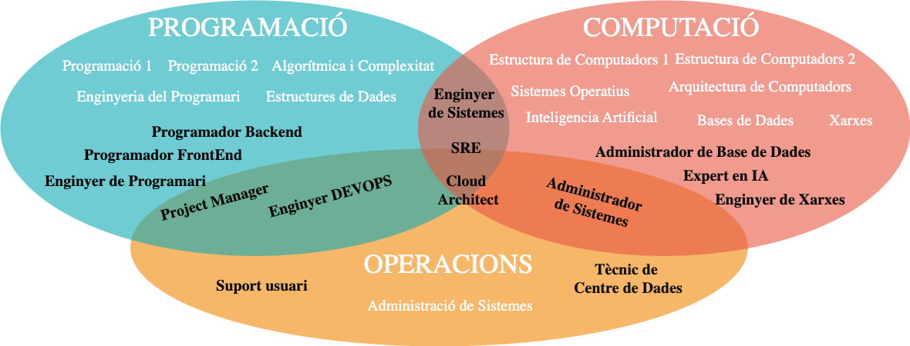

::: notes
L'administració de sistemes és una disciplina àmplia i diversa, que no segueix una única via d'aprenentatge. Aquesta professió inclou una gran varietat de rols i especialitzacions, però no compta amb un itinerari professional clarament establert, fet que dificulta l'ensenyament de tots els seus aspectes en una sola assignatura.

Si observeu el pla d'estudis del **Grau en Enginyeria Informàtica**, veureu que inclou assignatures orientades a la programació, amb sortides professionals com a desenvolupadors de software en diferents àmbits. Alhora, també ofereix formació en computació (*xarxes, sistemes operatius, bases de dades*), amb possibilitats laborals com a **enginyer de xarxes o administrador de bases de dades**.

Tradicionalment, l'**administració de sistemes** ha estat vinculada a les **operacions**, amb sortides professionals com a *tècnic de suport o tècnic de centre de dades*, sovint allunyades dels perfils d'un *enginyer informàtic*. No obstant això, avui en dia, l'administració de sistemes ha evolucionat significativament, donant lloc a perfils més avançats i tècnics com **DevOps, SRE (Site Reliability Engineer), i Cloud Engineer**, que ofereixen oportunitats laborals molt més atractives i alineades amb les necessitats del mercat actual.

Aquesta assignatura us introdueix a la *gestió de sistemes i aplicacions*, enfocada en les sortides professionals actuals i més especialitzades dins del sector IT.
:::

## Com s'apren a Administrar Sistemes?

\onslide<1->

L'administració de sistemes és una disciplina molt àmplia i no té una única via d'aprenentatge. És una professió amb una gran diversitat de rols i especialitzacions, però no segueix un camí de carrera establert.

::: columns
::: {.column width="50%"}

\onslide<2->

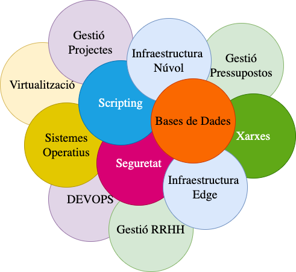

:::
::: {.column width="40%"}

\onslide<3->

- Determinats sistemes operatius (*Linux, Windows*...) o bé en flavours concrets (*Debian, Alma*, ...).

\onslide<4->

- Serveis específics (*DNS, E-Mail, Bases de dades...*)

\onslide<5->

- Àrees d'expertesa concretes (*Seguretat, Emmagatzematge, Xarxes, Datacenters*)

\onslide<6->

- Implementacions o proveïdors (*Oracle, Hadoop, Cisco*...)

\onslide<7>

- Cloud Computing (*AWS, Azure, Google Cloud*...)

:::
:::

::: notes

L'administració de sistemes és una disciplina molt àmplia i requereix de molts coneixements en diferents àrees de programació i scripting, xarxes, bases de dades, seguretat, virtualització, cloud computing, etc. i no té una única via d'aprenentatge. És una professió amb una gran diversitat de rols i especialitzacions, però no segueix un camí de carrera establert. La formació en administració de sistemes pot ser adquirida a través de diferents vies, com ara cicles formatius, graus en informàtica, bootcamps o certificacions de proveïdors com Red Hat, Cisco, AWS o Microsoft. En el nostre cas, l'assignatura d'Administració i Manteniment de Sistemes i Aplicacions us proporcionarà una visió general de l'administració de sistemes, amb una orientació cap a les sortides professionals més demandades en el mercat laboral i veurem una pinzellada de les especialitzacions més comunes en aquest camp. Això us permetrà especialitzar-vos en àrees concretes d'interès i preparar-vos per a perfils amb més responsabilitat i especialització dins del camp de les tecnologies de la informació.
:::

## Objectius del curs

\onslide<1->

- **Introduir-vos en el món de l'administració de sistemes i aplicacions**, així com en la seva gestió i manteniment.

\onslide<2->

- **Repasar llenguatges de programació i scripting** per a l'automatització de tasques. *Bash, AWK, YAML*, que ens permetran utilitzar eines com **Ansible, AWS CloudFormation, Docker, Kubernetes, etc**.

\onslide<3->

- Apendre a **gestionar, configurar i monitoritzar servidors** en entorns físics i virtuals.

\onslide<4->

- **Introduir-vos en el món del Cloud Computing** i les seves principals plataformes (*AWS, Azure, Google Cloud*).

\onslide<5->

- **Desplegar serveis Web, Bases de Dades, Aplicacions i Infraestructures** en diferents entorns.

## Metodologia

\onslide<1->

- **Sessions de Teoria**. Presentació dels continguts teòrics de l'assignatura. El format serà de presentació de diapositives amb exemples il·lustratius, resolució de problemes i discussió de casos pràctics.

\onslide<2->

- **Sessions de Pràctiques**. Metodologia activa i asincrònica que permet a cada estudiant o grup avançar al seu ritme. El material de treball seran Laboratoris de treball en grup. El contingut és autosuficient, i la funció del professor és fomentar el debat i ajudar a resoldre dubtes.

\onslide<3->

- **Treball autònom**. Implica la finalització dels Laboratoris i l'elaboració d'informes a partir dels reptes proposats. També inclou la lectura i visualització de documentació tècnica; així com la realització d'activitats al cloud AWS.

## Avaluació

\onslide<1->

### Criteris d'Avaluació

|Bloc | Activitat | Pes | Recuperable? | Nota Mínima? | Grup?|
|--- | --- | --- | --- | --- | --- |
|Parcial 1 (E1) | Examen Parcial 1 | 40% | Sí | No | No |
|Parcial 2 (E2) | Examen Parcial 2 | 40% | Sí | No | No |
|Laboratoris | Lab01-Lab10 | 10% | No | No | Si |
|AWS | Activitats AWS | 10% | No | No | No |

\onslide<2->

### Extra

1. **Manteniment de notes setmanals** (*fins a 10%*).
2. **Correcció, detecció i millora dels materials** (*fins a 10%*).

## Extra: Manteniment de Notes Setmanals

::: columns
::: {.column width="45%"}

\onslide<1->

- **Objectiu**: Fomentar la reflexió i l'autoavaluació dels continguts treballats a classe.
- **Metodologia**: Cada setmana, els estudiants han de fer un commit al seu repositori d'apunts amb les notes de les sessions de teoria i pràctiques.
- **Avaluació**: Es valorarà la qualitat de les notes, la seva coherència i la seva relació amb els continguts treballats, així com les reflexions i opinions personals incloses.

:::
::: {.column width="45%"}

\onslide<2->

### Exemple de Notes

```markdown
## Setmana X

# Resum teòric

# Exemples pràctics

# Dubtes i preguntes

# Reflexions personals
```

:::
:::

## Extra: Correcció, Detecció i Millora dels Materials

\onslide<1->

Els materials de l'assignatura segueixen la metodologia de *Open Source*. Això vol dir que qualsevol estudiant pot detectar errors, millorar els materials o afegir continguts nous. Per tant, cada estudiant pot fer *fork* del repositori de l'assignatura i fer *pull request* amb les seves correccions i millores.

\onslide<2->

\smartdiagram[flow diagram:horizontal]{
  \textbf{↓} Pull \texttt{(git pull)},
  Create a branch \texttt{(git branch)},
  Make Changes,
  \textbf{↑} Push Changes \texttt{(git push)},
  Pull Request
}

\onslide<3->

- **Branca Main**: Reservada per estar sincronitzada amb els materials oficials.
- **Branques de treball**: Cada estudiant pot crear una branca per fer canvis i millorar els materials.

\onslide<4->

S'avaluarà la quantitat i qualitat de les correccions, deteccions i millores realitzades en els materials de l'assignatura.

## Normativa del curs (I) - *Assistència i Entregues*

\onslide<1->

- Els **laboratoris són activitats pràctiques autoguiades**. Per obtenir una qualificació mínima de 5 en cada laboratori, cal presentar un document breu amb captures de pantalla que validin la realització de l'activitat, *llevat que s'indiqui el contrari en l'enunciat*.

\onslide<2->

- L'assignatura **no inclou una pràctica o projecte final**. No obstant això, **tot el contingut treballat als laboratoris pot ser avaluat als exàmens parcials**.

\onslide<3->

- Els laboratoris s'han de lliurar setmanalment. Les [entregues fora de termini tindran una penalització del 25% de la nota final]{.alert}.

## Normativa del curs (II) - *Gestió dels grups*

\onslide<1->

- Cada estudiant és responsable de la seva pròpia feina i de com gestiona el seu temps. L'assistència a classe no és obligatòria, però és altament recomanable per garantir el seguiment adequat de l'assignatura.

\onslide<2->

- Durant les sessions de laboratori, es fomenta el treball en grup, sempre de manera ordenada i respectuosa envers els companys.

\onslide<3->

- Cada alumne ha de presentar evidències pròpies del treball realitzat, encara que es col·labori en grup.

## Normativa del curs (III) - *Exàmens i Avaluació*

\onslide<1->

- Els exàmens són escrits i no està permès l'ús d'ordinadors. Es permetrà una fulla manuscrita A4 amb apunts, notes o fórmules.

\onslide<2->

- L'ús d'eines d'intel·ligència artificial està permès durant el curs, sempre que no es limiti a un simple copiar i enganxar. Heu de justificar les vostres respostes amb reflexions i opinions personals.

\onslide<3->

- Es demana que els estudiants arribin puntuals a les sessions. L'entrada tardana pot interrompre la dinàmica de la classe i el treball dels companys.

## Eines

\onslide<1->

- Ordinador portàtil amb connexió a Internet.
  - Es recomana portar el vostre propi ordinador per cursar l’assignatura.
  - Si no disposeu d’ordinador, podreu utilitzar els ordinadors de la classe durant les sessions de laboratori.

\onslide<2->

- Distribucions Linux (Debian i AlmaLinux)
  - És obligatori utilitzar les distribucions indicades als laboratoris. Altres distribucions no rebran suport.

\onslide<3->

- Software de virtualització (VMWare)
  - Es recomana utilitzar VMWare, però podeu optar per altres opcions de virtualització. Heu de ser capaços d’adaptar el material al vostre programari de virtualització.

## Materials i Recursos

> 1. Apunts de l'assignatura i materials complementaris proporcionats pel professor al campus virtual.
> 2. Laboratoris i activitats pràctiques disponibles al repositori de l'assignatura.
> 3. Documentació oficial de les eines i tecnologies utilitzades.
> 4. Fòrums tècnics a la xarxa com Stack Overflow, Reddit, etc.
> 5. Llibres de referència en administració de sistemes:
     - **"UNIX and Linux System Administration Handbook"** de Evi Nemeth, Garth Snyder, Trent R. Hein, Ben Whaley.
     - **"The Practice of System and Network Administration"** de Thomas A. Limoncelli, Christina J. Hogan, Strata R. Chalup.

# La feina de l'administrador de sistemes

## El rol de l'administrador de sistemes -  *Similituds amb un bomber*

\onslide<1->

> Els administradors de sistemes han de tenir coneixements tècnics profunds i una actitud proactiva per anticipar problemes i, si cal, resoldre'ls sota pressió, tal com ho faria un bomber en una emergència.

\onslide<2->

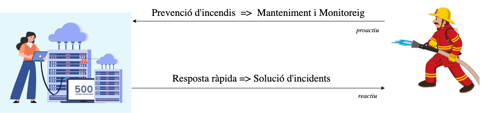

::: notes
El rol tradicional de l'aministrador de sistemes pot ser semblant al d'un bomber. Ha de treballar per prevenir incendis, però quan hi ha un incendi ha de córrer per apagar-lo i restaurar la situació el més ràpid. No importa l'hora, el lloc o el dia, l'administrador de sistemes ha de ser capaç de respondre a les emergències i solucionar els problemes de manera eficient i efectiva. Això requereix una gran habilitat tècnica, coneixements profunds dels sistemes i una actitud proactiva per anticipar-se als problemes i resoldre'ls ràpidament. Els administradors de sistemes han de ser tant proactius com reactius, prevenint problemes i responent ràpidament davant els imprevistos per garantir la continuïtat del servei. Poden utilitzar eines com Nagios, Zabbix, Prometheus per monitoritzar els sistemes i detectar problemes abans que es converteixin en emergències reals. Però, han d'intervenir i improvisar quan calgui per resoldre els problemes i restaurar la normalitat.
:::

## El rol de l'administrador de sistemes - *Similituds amb un científic*

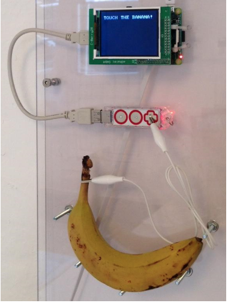{width=60mm}

::: notes
Un altra característica de l'administrador de sistemes és la seva capacitat per resoldre problemes complexos i trobar solucions creatives. Això pot ser semblant al treball d'un científic, que ha de plantejar hipòtesis, realitzar experiments i analitzar dades per arribar a conclusions.

Per exemple, una empresa pot necessitar donar codis d'accés temporals als usuaris per connectar-se a la xarxa Wifi. En lloc de gestionar-ho manualment, un administrador de sistemes va crear un sistema que generava codis d'accés temporals quan els usuaris tocaven un platan connectada a un Raspberry Pi. Aquesta solució creativa i inesperada va permetre automatitzar una tasca manual i millorar l'experiència de l'usuari. Això demostra la capacitat de l'administrador de sistemes per trobar solucions innovadores i eficients als problemes que es presenten.
:::

## El rol de l'administrador de sistemes

::: center
\scalebox{0.9}{ % Escala al 90%
  \smartdiagram[connected constellation diagram]
  {Administrador de Sistemes, Administrador de la web, Administrador de la base de dades, Administrador de la xarxa, Administrador de la seguretat, Programador, Altres usuaris}
    }
:::

::: notes
Si analitzem una empresa podem pensar en diferents rols i necessitats, com l'administrador de la web, l'administrador de la base de dades, l'administrador de la xarxa, l'administrador de la seguretat, els programodors, usuaris,... L'administrador de sistemes ha de ser capaç de coordinar i gestionar tots aquests rols per garantir el funcionament i la seguretat dels sistemes informàtics de l'empresa. Moltes vegades petites emrpeses no tenen aquests rols dedidcats i l'administrador de sistemes ha de fer-ho tot. En empreses mitjanes, es poden tenir rols dedicats en algunes tasques i la resta les fa l'administrador de sistemes. En empreses grans, normalment, hi ha un equip dedicat dirigit/cordinat per un administrador de sistemes. En tots els casos, l'administrador de sistemes és l'encarregat de gestionar l'accés als recursos mitjançant usuaris i rols.
:::

## Salari d'un Administrador de Sistemes

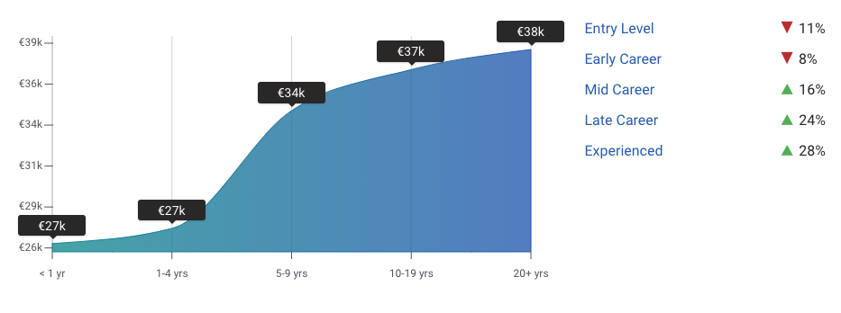{width="70%"}

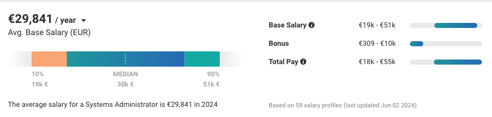{width="70%"}

::: notes

El salari base segons el portal payscale a Espanya és de mitjana 30k amb un potencial de creixement a futtur de 10k. Aquesta dada és orientativa i pot variar segons la ubicació, l'experiència, les habilitats i la formació del professional. Però, en comparativa amb altres sortides professionals, l'administrador de sistemes igual no és una opció interessant. Analitzem ara sortides professionals més especialitzades.

:::

## Especialitzacions en Administració de Sistemes

::: columns
::: {.column width="45%"}

> - Administradors de Xarxa, Enmagatzematge, Seguretat
> - Operadors de Xarxa
> - Arquitectes de Sistemes
> - Tècnics de Suport
> - Tècnics de Centre de Dades
> - Enginyers de Sistemes
> - Enginyer DEVOPS
> - Enginyer SRE (Site Reliability Engineer)

:::
::: {.column width="45%"}

[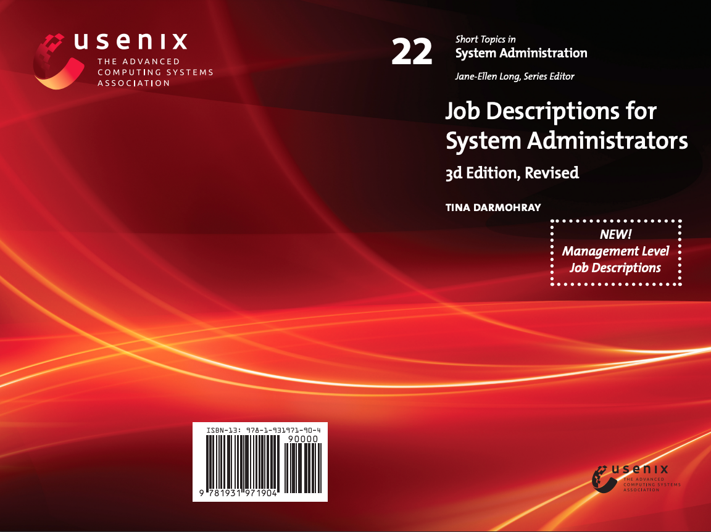](https://2459d6dc103cb5933875-c0245c5c937c5dedcca3f1764ecc9b2f.ssl.cf2.rackcdn.com/books/22_jobs3rd_complete.pdf)

:::
:::

::: notes

L'administració de sistemes compta amb diverses especialitzacions, cadascuna amb tasques específiques que poden influir en els rols i salaris. A continuació, es presenten algunes de les més rellevants:

- **Administradors de Xarxa**: Gestionen dispositius com routers, switches i firewalls, garantint la seguretat i la connectivitat de les xarxes.
- **Administradors d'Emmagatzematge**: S'encarreguen de sistemes de còpia de seguretat i emmagatzematge de dades, assegurant la seguretat i l'accessibilitat.
- **Administradors de Seguretat**: Implementen polítiques per protegir els sistemes d'amenaces i ciberatacs.
- **Operadors de Xarxa**: Supervisionen el funcionament diari de les xarxes i resolen problemes de rendiment o connexió.
- **Arquitectes de Sistemes**: Dissenyen la infraestructura tecnològica, garantint escalabilitat, seguretat i rendiment.
- **Tècnics de Suport**: Proporcionen assistència tècnica als usuaris, resolent incidències.
- **Tècnics de Centre de Dades**: Gestionen servidors i equips en centres de dades, assegurant alta disponibilitat.
- **Enginyers de Sistemes**: Implementen i mantenen la infraestructura de l'empresa, garantint el funcionament operatiu.
  
Les especialitzacions més avançades inclouen **Enginyer DevOps i Enginyer SRE** (Site Reliability Engineer), amb gran demanda en el mercat actual.
:::

## Què és un Site Reliability Engineer (SRE)?

\onslide<1->

Els Site Reliability Engineers (SRE) són enginyers de sistemes especialitzats en la fiabilitat i l'escalabilitat dels sistemes informàtics. Estan centrats en les operacions, utilitzant el software com a eina per gestionar els sistemes, solucionar els afers i automatitzar tasques. Les seves missions són crear sistemes escalables i fiables.

\onslide<2->

::: columns
::: {.column width="45%"}

::: center
\scalebox{0.8}{
  \smartdiagram[circular diagram]{
      Fiabilitat del Sistema,
      Escalabilitat,
      Monitorització i Alertes,
      Gestió d'Incidents,
      Optimització de Rendiment,
      Automatització de Processos
  }
}
:::

:::
::: {.column width="45%"}

\onslide<3->

- **Fiabilitat del Sistema**:  Nagios, Zabbix, Prometheus.
  
\onslide<4->

- **Escalabilitat**: Kubernetes, Docker, Terraform.

\onslide<5->

- **Monitorització i Alertes**: Grafana, ELK Stack, PagerDuty.

\onslide<6->

- **Gestió d'Incidents**: Jira, ServiceNow, Slack.

\onslide<7->

- **Optimització de Rendiment**: New Relic, Datadog, AppDynamics.

\onslide<8->

- **Automatització de Processos**: Ansible, Puppet, Chef.

:::
:::

::: notes
Amb l'evolució contínua de les tecnologies cloud i l'augment de la demanda de serveis digitals, les pràctiques de Site Reliability Engineering (SRE) s'han convertit en una peça clau per a moltes organitzacions. Un SRE es pot definir com un professional especialitzat en garantir que les empreses compleixin els seus Acords de Nivell de Servei (SLA) pel que fa a disponibilitat, rendiment, experiència de l'usuari i indicadors clau de negoci (KPIs). Això implica centrar-se en la millora de la fiabilitat i l'escalabilitat dels sistemes, així com en la implementació de pràctiques d'integració i lliurament continu (CI/CD), reforçar la seguretat i optimitzar els costos operatius.

Els SREs aprofiten el programari com una eina per gestionar i automatitzar els sistemes, identificar i resoldre problemes, i automatitzar processos amb l'objectiu final de construir infraestructures escalables i fiables que responguin als objectius de negoci.

Les funcions principals d'un SRE inclouen la monitorització constant dels sistemes, la gestió d'alertes i resposta a incidents, l'automatització de tasques rutinàries, i l'optimització de l'escala i adaptabilitat dels recursos tecnològics. A més, col·laboren estretament amb els equips de desenvolupament per assegurar la millora contínua de la fiabilitat i el rendiment dels sistemes.
:::

## Salari d'un Site Reliability Engineer

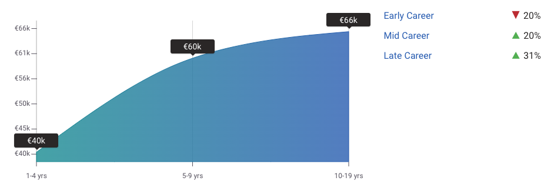


::: notes

Els Site Reliability Engineers (SREs) experimenten un increment salarial substancial en comparació amb els administradors de sistemes. Un SRE pot començar guanyant fins a 50.000 € durant el seu primer any, i amb l'experiència, arribar fins als 70.000 € o més en un termini de cinc anys. Aquest diferencial salarial reflecteix la creixent importància i demanda de professionals especialitzats en la fiabilitat i escalabilitat dels sistemes informàtics. A diferència dels administradors de sistemes, els SREs no només es dediquen a mantenir la infraestructura, sinó que també se centren en optimitzar la resiliència i eficiència dels serveis digitals, assegurant que compleixin els Acords de Nivell de Servei (SLA). Per tant, si t'interessa un rol amb responsabilitats més tècniques i un potencial de creixement major, el camí d'SRE pot ser una opció molt atractiva dins del mercat laboral actual. Les seves responsabilitats dins de l'empresa són molt importants i tenen un impacte directe amb els objectius de negoci.
:::

## Què és un DevOps Engineer?

\onslide<1->

Els DevOps Engineers són professionals clau en la integració i col·laboració entre els equips de desenvolupament (Dev) i operacions (Ops), amb l'objectiu principal de millorar l'eficiència i agilitat dels processos de desenvolupament de software. El seu treball se centra en accelerar el desplegament d'aplicacions, millorar la qualitat del software i optimitzar els fluxos de treball, fent ús intensiu de l'automatització, la integració contínua (CI) i el lliurament continu (CD).

::: columns
::: {.column width="45%"}

\onslide<2->

::: center
\scalebox{0.7}{
  \smartdiagram[circular diagram]{
      Automatització,
      CI/CD,
      Infraestructura com a Codi (IaC),
      Contenidors i Orquestració,
      Monitorització i Registre,
      Col·laboració i Comunicació
  }
}
:::

:::
::: {.column width="45%"}

\onslide<3->

- **Automatització**:  Jenkins, GitLab CI, Bamboo.

\onslide<4->

- **Gestió d'infraestructura com a codi (IaC)**: Terraform, Ansible, CloudFormation.

\onslide<5->

- **Contenidors i orquestració**: Docker, Kubernetes.

\onslide<6->

- **Monitorització i registre**: Prometheus, Grafana, ELK Stack.

\onslide<7->

- **Col·laboració i comunicació**: Slack, Jira, Confluence.

:::
:::

::: notes
Els **Sysadmins** tradicionalment s'encarreguen de la gestió i manteniment de la infraestructura, com servidors i xarxes. Els **DevOps Engineers**, però, van més enllà, enfocant-se en l'automatització de processos, la creació de pipelines de CI/CD i la gestió de contenidors (Docker) i infraestructura com a codi (IaC) amb eines com Terraform o Ansible. El seu objectiu és integrar desenvolupament i operacions per garantir llançaments de software ràpids i segurs.

Els **SREs (Site Reliability Engineers)** comparteixen eines amb els DevOps, però amb un enfocament diferent: la fiabilitat i escalabilitat dels sistemes en producció. Es concentren en mantenir els serveis actius, gestionar incidents i complir els SLA, mentre que els DevOps se centren en optimitzar els processos de desenvolupament i col·laboració entre equips. Tot i les similituds en les tecnologies que utilitzen, els seus objectius divergeixen: els DevOps milloren els processos de desenvolupament, i els SREs asseguren la resiliència del sistema.
:::

## Salari d'un DevOps Engineer

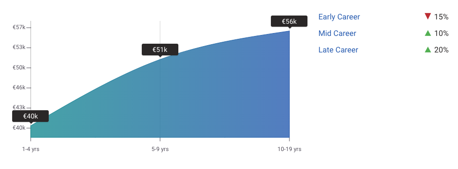


::: notes

Els DevOps Engineers, igual que els SREs, gaudeixen d'un salari més alt i d'un major potencial de creixement professional en comparació amb els administradors de sistemes tradicionals. Si t'apassiona l'administració de sistemes enfocada a l'automatització del desplegament de software, el disseny i la gestió de pipelines de CI/CD, l'ús de contenidors i la implementació d'infraestructura com a codi, el rol de DevOps Engineer pot oferir-te una carrera més atractiva i plena d'oportunitats. En l'actualitat, moltes empreses busquen professionals amb habilitats en DevOps.
:::

## Transfomració del Administrador de Sistemes a SRE

::: columns
::: {.column width="65%"}

[](https://www.youtube.com/watch?v=DGLpUoh-waM)

:::
::: {.column width="30%"}

### DevOpsCon 2019 - SysAdmin to SRE

Damon Edwards, co-fundador de Rundeck, parla de la transformació d'un administrador de sistemes a un Site Reliability Engineer (SRE) i com aquesta evolució pot ajudar a millorar la fiabilitat dels sistemes i la productivitat dels equips de desenvolupament. Aquesta xerrada va ser presentada a la DevOpsCon 2019.

:::
:::

::: notes
En aquest curs, veure una pinzellada de les tasques d'un SRE i d'un DevOps Engineer quan introduïm les eines de monitorització, automatització i CI/CD. Però, si voleu aprofundir en la temàtica, us recomano aquesta xerrada de la DevOpsCon, per Damon Edwarks, que parla del tema i explica com un administrador de sistemes es pot transformar en un SRE tenint en compte una responsabilitat compartida entre els SLOs i els errors de pressupost.

:::

# Terminologia bàsica

## Què és una arquitectura Client-Servidor?

\onslide<1->

Una arquitectura **client-servidor** involucra uns sistemes que necessiten serveis i uns servidors que processen i responen a aquestes peticions.

::: columns
::: {.column width="35%"}

\onslide<2->

### Client

Un ordinador o dispositiu capaç de rebre informació o utilitzar un servei o proveïdor.

\onslide<3->

### Servidor

Un ordinador o dispositiu remot capaç de proveir accés a un servei o a informació.

:::
::: {.column width="60%"}

\onslide<4->

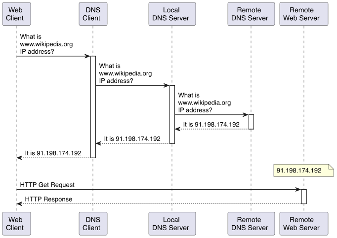

:::
:::

::: notes
Un dels conceptes més importants en l'administració de sistemes és l'arquitectura client-servidor. Aquesta arquitectura implica la interacció entre dos tipus de sistemes: els clients, que sol·liciten serveis o informació, i els servidors, que processen i responen a aquestes peticions. Aquesta arquitectura és àmpliament utilitzada en entorns informàtics, com ara la web, les xarxes d'ordinadors i les aplicacions empresarials.

Per exemple, quan un usuari accedeix a una pàgina web, el seu navegador actua com a client i sol·licita la pàgina al servidor web. El servidor de DNS consulta la URL i retorna l'adreça IP del servidor web. El navegador envia una petició HTTP o HTTPS al servidor web, que respon amb els fitxers necessaris per mostrar la pàgina al navegador. Aquest procés implica la comunicació entre el client i el servidor per proporcionar la informació sol·licitada a l'usuari.
:::

## Quines són les avantatges i inconvenients d'una arquitectura Client-Servidor?

::: columns
::: {.column width="45%"}

### Avantatges

> - Sistema centralitzat \blueArrow Totes les dades en un lloc.
> - Polítiques de recuperació de dades.
> - Separació de la lògica.

### Inconvenients

> - Atacs de denegació de serveis.
> - Man-in-the-middle.
> - Phishing.
> - Spoofing.
  
:::
::: {.column width="45%"}

:::center
)](../../figs/tema0/terminologia/client-server.png){width=40mm}
:::

:::
:::

::: notes

- Múltiples clients es comuniquen amb un servidor central.
- Múltiples servidors poden comunicar-se amb altres servidors.
- 1 client pot comunicar-se amb múltiples servidors.
- Un client pot accedir a un servidor web per obtenir informació i a un servidor de correu per enviar correus electrònics.
- El servidor web pot comunicar-se amb el servidor de correu per enviar notificacions als usuaris.
:::

## Quins són els tipus de servidors més comuns?

::: columns
::: {.column width="45%"}

> - Servidor d'autenticació.
> - Servidor de fitxers.
> - Servidor de discos.
> - Servidor de correu.
> - Servidor de base de dades.
:::
::: {.column width="45%"}
> - Servidor SSH.
> - Servidor Web.
> - Servidor d'aplicacions.
> - Servidor de backups.
> - Servidor de còmput.
:::
:::

::: center
)](../../figs/tema0/terminologia/example-servers.png){width=80mm}
:::

::: notes
A la figura proporcionada es mostra una arquitectura típicament utilitzada per al desplegament d'una web escalable i fiable. En aquesta arquitectura, el punt d'entrada és un balancejador de càrrega, que distribueix les peticions entre els diversos servidors web. Els servidors web, que poden ser rèpliques, allotgen les pàgines web i gestionen les peticions dels usuaris. Aquestes pàgines web necessiten accedir a un servidor de base de dades per emmagatzemar i gestionar les dades associades.
Cada base de dades està protegida per un servidor de backups, que realitza còpies de seguretat per garantir la recuperació en cas de fallades. A més, per millorar la velocitat de càrrega de les pàgines web, es fa servir un dispositiu CDN (Content Delivery Network) que redirigeix les peticions als servidors més propers a l'usuari.

Aquesta arquitectura és àmpliament utilitzada per allotjar llocs webs, ja que ofereix una combinació d'escalabilitat i fiabilitat, assegurant un rendiment òptim i una alta disponibilitat per als usuaris finals.
:::

## Quins són els problemes més comuns en els servidor? (I)

\onslide<1->

- **Qui i com accedeix a la informació?**
  - Determinar qui (usuari,procés,servei) pot accedir a quins fitxers i directoris i com ho pot fer (lectura, escriptura, execució).
  - Permisos, ACLs, polítiques de seguretat.

\onslide<2->

- **Com protegeixo la informació?**
  - Determinar com protegir la informació sensible i confidencial.
  - Encriptació, contrasenyes, autenticació, autorització, auditoria, backups.
  
\onslide<3->

- **Com asseguro el sistema?**
  - Protegir el sistema contra atacs i amenaces.
  - Firewall, IDS/IPS, antivirus, actualitzacions, patches, hardening.

\onslide<4->

- **Com puc saber si el client és qui diu ser?**
  - Autenticar els usuaris i els dispositius.
  - Contrasenyes, certificats digitals, autenticació multifactorial.

::: notes

Un dels problemes principals en els servidors és controlar qui accedeix a la informació i com ho fa. Això es gestiona mitjançant permisos, llistes de control d'accés (ACLs) i polítiques de seguretat per assegurar que només els usuaris autoritzats puguin accedir als fitxers i directoris, i establir si poden llegir, escriure o executar aquests elements.

També protegir la informació sensible contra l'accés no autoritzat. Aquest objectiu es pot assolir amb tècniques com l'encriptació, l'ús de contrasenyes, l'autenticació, l'autorització i l'auditoria, així com mitjançant còpies de seguretat (backups), per garantir la seguretat i privacitat de les dades.

Finalment, cal defensar el sistema contra possibles atacs i amenaces, tant externs com interns. Per aconseguir-ho, es poden utilitzar eines com firewalls, sistemes de detecció i prevenció d'intrusions (IDS/IPS), antivirus i actualitzacions de seguretat, així com tècniques d'autenticació robusta, incloent l'autenticació multifactorial, per protegir els accessos.

Finalment, un altre problema és com autenticar els usuaris i els dispositius per garantir que siguin qui diuen ser. Això implica autenticar els usuaris i els dispositius per garantir que només els usuaris autoritzats puguin accedir a la informació. Per fer-ho, es poden utilitzar tècniques com les contrasenyes, els certificats digitals i l'autenticació multifactorial per garantir la seguretat i la privacitat de la informació.

:::

## Quins són els problemes més comuns en els servidor? (II)

\onslide<1->

- **Quins avantatges/inconvenients té un disseny respecte a un altre?**
  - Determinar quin disseny és més adequat per a les necessitats de l'empresa.
  - Escalabilitat, rendiment, seguretat, disponibilitat, fiabilitat.

\onslide<2->

- **Com asseguro el bon funcionament?**
  - Garantir que el sistema funcioni correctament i sense problemes.
  - Monitorització, alertes, backups, redundància, tolerància a fallades.

\onslide<3->

- **Com dissenyo polítiques i plans d'emergència si tot falla?**
  - Preparar-se per a situacions d'emergència i desastres.
  - Plans de contingència, plans de recuperació, plans de resposta a incidents.

\onslide<4->

- **Com analitzo post-mortem les causes d'un atac?**
  - Identificar les causes d'un atac i prendre mesures correctives.
  - Anàlisi forense, auditoria, millora contínua.

::: notes
Un altre problema comú és determinar quins avantatges i inconvenients té un disseny respecte a un altre. Això implica determinar quin disseny és més adequat per a les necessitats de l'empresa en termes d'escalabilitat, rendiment, seguretat, disponibilitat i fiabilitat. Per fer-ho, es poden avaluar els avantatges i inconvenients de cada disseny per garantir que s'adeqüi a les necessitats de l'empresa.

Un altre problema és com assegurar el bon funcionament del sistema. Això implica garantir que el sistema funcioni correctament i sense problemes. Per fer-ho, es poden utilitzar tècniques com la monitorització, les alertes, els backups, la redundància i la tolerància a fallades per garantir que el sistema funcioni correctament i sense problemes.

Un altre problema és com dissenyar polítiques i plans d'emergència si tot falla. Això implica preparar-se per a situacions d'emergència i desastres per garantir la continuïtat del negoci. Per fer-ho, es poden utilitzar plans de contingència, plans de recuperació i plans de resposta a incidents per garantir que l'empresa pugui respondre de manera eficaç a situacions d'emergència i desastres.

Finalment, un altre problema és com analitzar post-mortem les causes d'un atac per identificar les causes i prendre mesures correctives. Això implica realitzar una anàlisi forense, una auditoria i una millora contínua per identificar les causes d'un atac i prendre mesures correctives per evitar que es repeteixin en el futur.
:::

## Què és un centre de dades?

\onslide<1->

Un centre de dades és un espai físic on s'allotgen els servidors, els dispositius de xarxa i altres equips informàtics necessaris per emmagatzemar, processar i distribuir la informació.

\onslide<2->

:::center
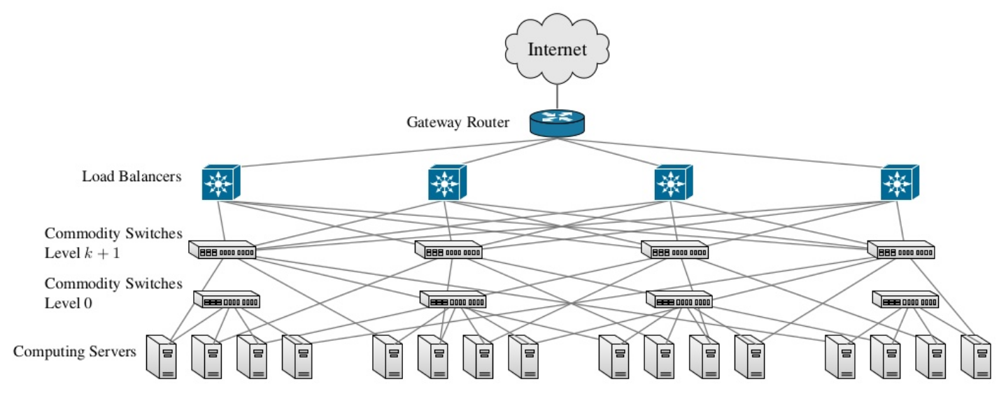{width=130mm}
:::

::: notes
Aquests centres de dades poden ser propis de l'empresa o externs, i poden ser gestionats per l'empresa o per un proveïdor de serveis. Els centres de dades són essencials per a les empreses que necessiten emmagatzemar i processar grans quantitats de dades, ja que proporcionen l'espai, la infraestructura i els recursos necessaris per garantir el funcionament dels sistemes informàtics.

Un exemple notable de reutilització d'estructures per a centres de dades és l'ús d'edificis històrics com esglésies i mines abandonades. Aquests espais, amb les seves condicions úniques i sovint amb una infraestructura sòlida, són adaptats per allotjar servidors i equips. Per exemple, l'antiga església de Saint-Ouen a França ha estat convertida en un centre de dades, aprofitant la seva estructura i espai per complir amb els requisits tecnològics moderns. D'altra banda, la mina de carboni de Pionen a Suècia ha estat transformada en un centre de dades subterrani, oferint una protecció física addicional contra desastres naturals i atacs.

Google disposa de servidors al fons del mar, aprofitant l'energia de les ones per refredar els servidors i reduir el consum energètic. Aquestes iniciatives mostren la diversitat de solucions i enfoques per a la gestió de centres de dades, adaptant-se a les necessitats i condicions específiques de cada empresa.
:::

## Què és un rack?

\onslide<1->

Un **rack** és una estructura metàl·lica que allotja servidors, switches, routers i altres equips informàtics en un centre de dades.

\onslide<2->

:::center
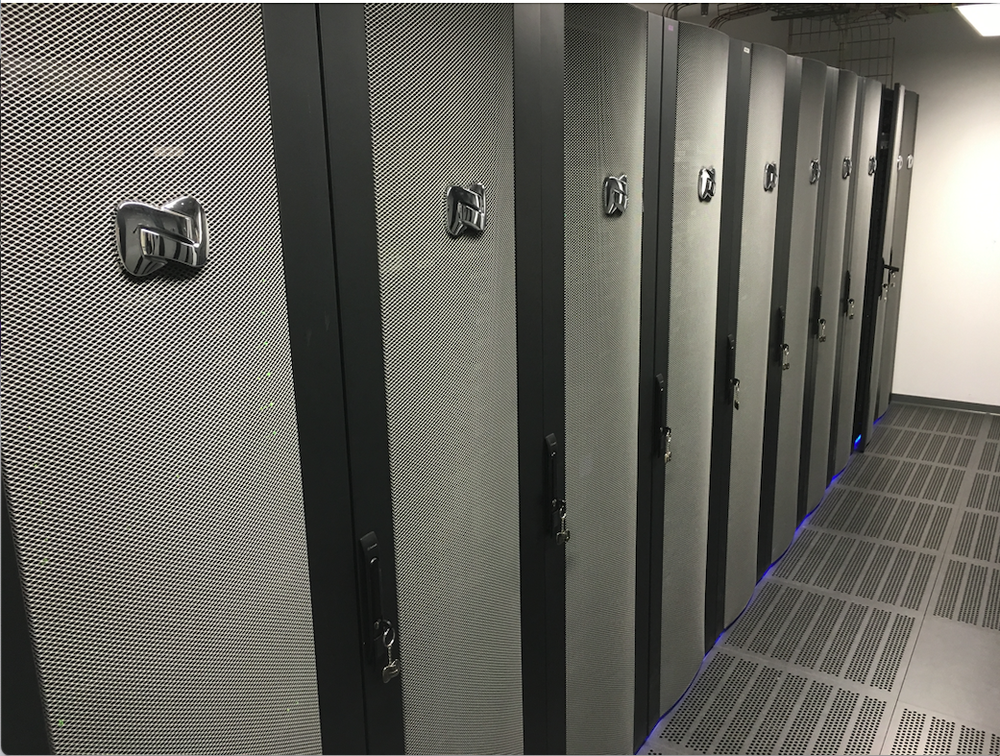{width=80mm}
:::

::: notes
Un rack és una estructura metàl·lica que allotja servidors, switches, routers i altres equips informàtics en un centre de dades. Aquests racks permeten organitzar i protegir els equips informàtics, així com facilitar la gestió dels cables i la refrigeració dels equips. Cada rack pot contenir diversos servidors, switches i altres equips, i es pot apilar verticalment per aprofitar l'espai disponible al centre de dades. A més, els racks disposen de panells laterals i portes per protegir els equips i garantir la seguretat dels servidors i altres equips informàtics.

Per exemple, a la imatge us mostro els racks d'un passadís del centre de dades de la Universitat de Lleida, on es poden aquests armaris, penseu que cada rack pot contenir diversos servidors, switches i altres equips informàtics, i únciament es veu un dels múltiples passadissos del centre de dades. En aquest centre de dades és on tenim el Campus Virtual, les eines i dades dels estudiants i professors, així com els servidors de recerca dels grups de recerca de la UdL, entre d'altres.
:::

## Exemple de racks

::: columns
::: {.column width="45%"}

\onslide<1->

:::center
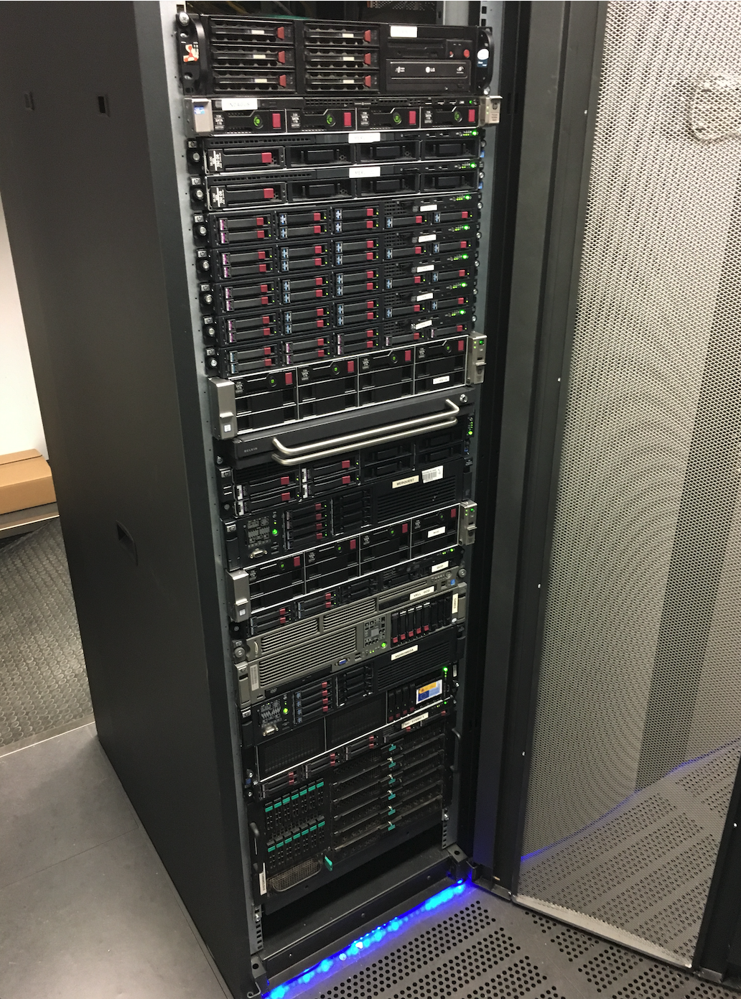{width=40mm}
:::
:::
::: {.column width="45%"}

\onslide<2->

:::center
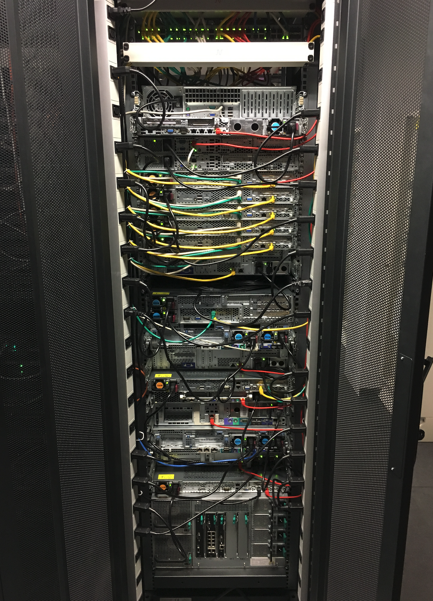{width=40mm}
:::
:::
:::

::: notes
Ara us mostro un rack, en concret els servidors són del grup de recerca en computació distribuïda. A la part de dalt es pot veure un switch, i la resta só servidors. A la part de davant es poden veure els servidors i a la part de darrera els cables de xarxa i alimentació. En aquest cas, hi ha diferents colors de cables per identificar la xarxa a la qual pertanyen i la seva funció.
:::

## Exemple de servidor

::: columns
::: {.column width="45%"}
:::center

\onslide<1->

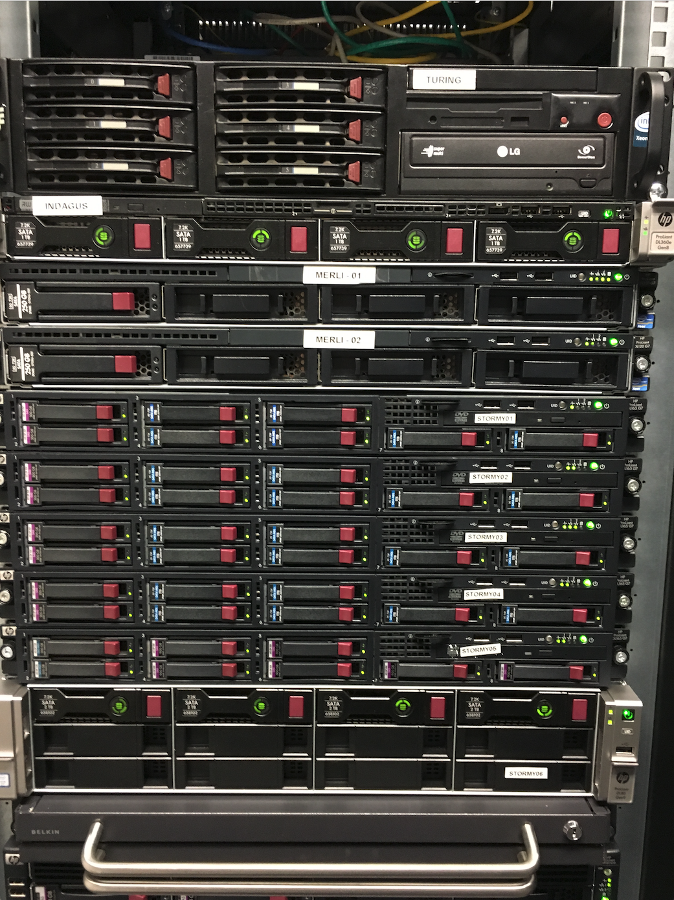{width=45mm}
:::
:::
::: {.column width="45%"}
:::center

\onslide<2->

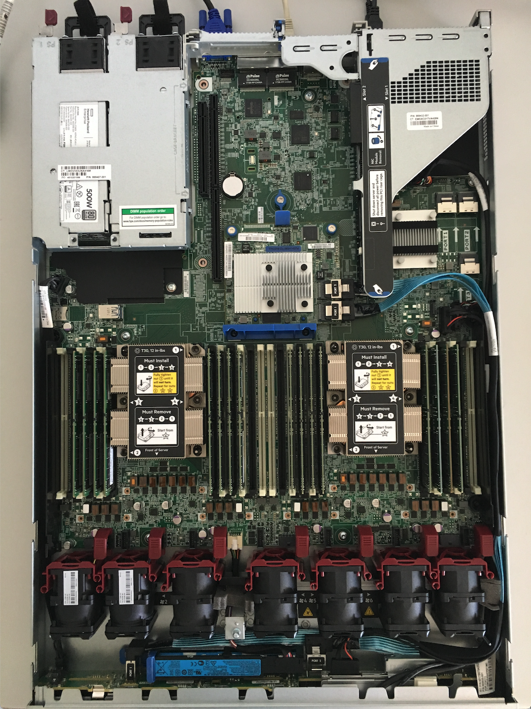{width=45mm}
:::
:::
:::

::: notes
En aquestes imatges podem fer zoom i veure els components exteriors i interiors d'un servidor. A la imatge 8 es pot veure com cada disc té un indicador de color per identificar el disc en cas de fallada. A la imatge 9 es pot veure la placa base, els discos durs, la font d'alimentació, la memòria RAM i el processador.
:::

## Què és un **switch**?

\onslide<1->

Un **switch** és un dispositiu de xarxa que connecta diversos equips informàtics per permetre la comunicació entre ells.

\onslide<2->

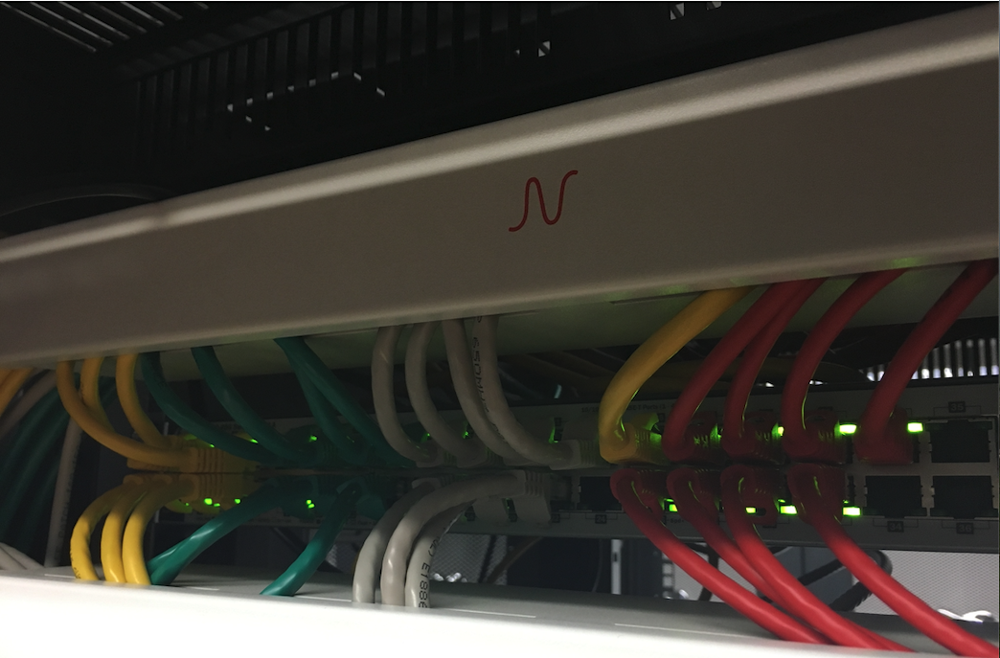{width=60mm}

::: notes
Un switch és un dispositiu de xarxa que connecta diversos equips per facilitar la comunicació entre ells. Cada switch utilitza una taula de comutació per dirigir les dades cap al destinatari correcte. Aquesta taula permet al switch conèixer quins equips estan connectats a quins ports i escollir la millor ruta per enviar les dades. Els ports del switch es poden configurar per assignar-los a VLANs (Xarxes Locals Virtuals), la qual cosa permet segmentar la xarxa en diverses sub-xarxes, millorant així la seguretat i el rendiment global de la xarxa.

No confondre un switch amb un router. Un switch connecta diversos equips dins de la mateixa xarxa local, mentre que un router connecta diverses xarxes locals o xarxes WAN (Xarxes d'Àrea Ampliada). Els routers utilitzen taula de rutes per determinar la millor ruta per enviar les dades entre xarxes, mentre que els switches utilitzen taula de comutació per enviar les dades entre equips dins de la mateixa xarxa local.
:::

# Disseny de sistemes informàtics

## Quines són les característiques d'un sistema?

::: center
\scalebox{0.9}{ % Escala al 90%
  \smartdiagram[connected constellation diagram]
  {Sistema,Simple,Escalable,Segur,Fiable,Disponible,Ràpid,Fàcil d'ús}
    }
:::

::: notes
En el disseny de sistemes informàtics, és important tenir en compte diverses característiques per garantir que el sistema sigui eficient, segur i fiable. Algunes de les característiques més importants d'un sistema són la simplicitat, l'escalabilitat, la seguretat, la fiabilitat, la disponibilitat, el rendiment i la facilitat d'ús. Ara bé, sovint intentem dotar sistemes amb característiques que no es poden afegir després de la seva construcció. Per exemple, intentar aplicar *seguretat* després que les interfícies del sistema hagin estat definides produeix restriccions i limitacions; intentar fer un sistema amb limitacions intrínseques funcionar en circumstàncies per les quals no va ser dissenyat produeix *hacks* i *workarounds* i el resultat final sovint essembla més una casa de cartes fràgil que una estructura sòlida i fiable.

Per tant, quan discutim sobre el disseny de sistemes informàtics, és important tenir en compte aquestes característiques i assegurar-nos que el sistema compleixi els objectius de l'empresa i sigui capaç de respondre a les necessitats dels usuaris
:::

## Què és l'escalabilitat?

::: columns
::: {.column width="45%"}

\onslide<1->

L'**escalabilitat** és la capacitat d'un sistema per gestionar un augment de la càrrega de treball sense afectar el rendiment.

\onslide<2->

- **Vertical**: augmentar la capacitat d'un servidor afegint més recursos (CPU, memòria, disc).

\onslide<3->

- **Horitzontal**: augmentar la capacitat d'un sistema afegint més servidors.

\onslide<4->
Per exemple, el serveis al núvol permeten pagar només pel que s'utilitza, permetent augmentar o disminuir la capacitat segons les necessitats.

:::
::: {.column width="45%"}

\onslide<1->

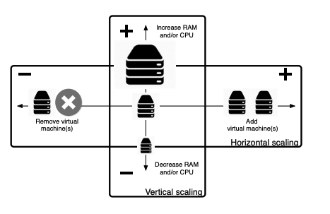

:::
:::

::: notes
Escalabilitat es refereix a la capacitat d'un sistema per gestionar un augment en la càrrega de treball sense que el seu rendiment es vegi afectat. És un concepte clau en el disseny de sistemes informàtics, especialment en entorns amb variacions en la demanda.

En l'entorn de cloud computing, aquest concepte es relaciona sovint amb elasticitat, que és la capacitat d'un sistema per adaptar-se de manera dinàmica a les fluctuacions de la càrrega de treball. Per exemple, una botiga en línia podria experimentar un augment significatiu de trànsit durant el Black Friday. Un sistema escalable i elàstic podria gestionar aquest augment de demanda sense perdre rendiment, i després reduir la capacitat quan la demanda torna a nivells normals.

L'objectiu és garantir que el sistema pugui mantenir un rendiment òptim i evitar problemes com temps d'espera llargs, errors o caigudes, que podrien afectar negativament l'experiència de l'usuari i els resultats comercials.
:::

## Què és la fiabilitat?

\onslide<1->

La **fiabilitat** d'un sistema es refereix a la seva capacitat per operar sense interrupcions durant un període determinat. La fiabilitat es mesura habitualment mitjançant el MTBF (Mean Time Between Failures), que indica el temps mitjà que un sistema pot funcionar abans de fallar. Per exemple, si un sistema té un MTBF de 1000 hores, això vol dir que, de mitjana, es pot esperar que el sistema falli cada 1000 hores d'ús.

\onslide<2->

$$ MTBF = \frac{Temps\ total\ de\ funcionament}{Nombre\ de\ fallades} $$

\onslide<3->

Per millorar la fiabilitat i minimitzar les interrupcions, es poden implementar tècniques com la redundància. Un exemple comú és l'ús de servidors en configuració de calent i fred:

\onslide<4->

- **Servidor en calent**: És el servidor principal que està en funcionament i gestionant les operacions actuals.

\onslide<5->

- **Servidor en fred**: És un servidor de reserva que es manté en espera i es posa en marxa només quan el servidor en calent falla.

::: notes
La **fiabilitat** és la capacitat d'un sistema per mantenir-se operatiu durant un període de temps determinat sense fallar. Es mesura en MTBF (Mean Time Between Failures). Per exemple, un sistema amb un MTBF de 1000 hores es pot esperar que falli cada 1000 hores d'ús.

Una forma d'evitar fallades és la redundància, imagineu que tenim un servidor en calent (actual) i un servidor en fred (reserva) que es posa en marxa en cas de fallada del servidor actual. En aquest cas, el sistema és més fiable perquè si falla el servidor actual, el servidor de reserva pot prendre el relleu sense afectar el servei. La contrapartida és que aquesta redundància implica un cost addicional.
:::

## Què és la disponibilitat?

\onslide<1->
La **disponibilitat** d'un sistema es refereix a la seva capacitat per estar operatiu i accessible per als usuaris durant un període de temps determinat. La disponibilitat es mesura habitualment mitjançant el MTTR (Mean Time To Repair), que indica el temps mitjà que es triga a reparar un sistema després d'una fallada. Per exemple, si un sistema té un MTTR de 2 hores, això vol dir que, de mitjana, es triga 2 hores a reparar el sistema després d'una fallada.

\onslide<2->
$$ Disponibilitat = \frac{Temps\ de\ funcionament}{Temps\ de\ funcionament + Temps\ de\ reparar} $$

\onslide<3->
Per exemple, Amazon Web Services (AWS) ofereix un SLA (Service Level Agreement) del 99,99%, el que significa que el servei estarà disponible el 99,99% del temps. Si el servei no compleix aquest SLA, AWS pot compensar els clients amb crèdits de servei.

::: notes
La **disponibilitat** d'un sistema es refereix a la seva capacitat per estar operatiu i accessible per als usuaris durant un període de temps determinat. Es mesura en MTTR (Mean Time To Repair), que indica el temps mitjà que es triga a reparar un sistema després d'una fallada. Per exemple, si un sistema té un MTTR de 2 hores, això vol dir que, de mitjana, es triga 2 hores a reparar el sistema després d'una fallada. No confondre amb fiabilitat, que es refereix a la capacitat d'un sistema per operar sense interrupcions durant un període determinat.

Per exemple, un sistema pot tenir una alta fiabilitat, però una baixa disponibilitat si el temps de reparació després d'una fallada és llarg. D'altra banda, un sistema pot tenir una baixa fiabilitat, però una alta disponibilitat si es pot reparar ràpidament després d'una fallada. La disponibilitat es mesura en percentatge i es pot garantir mitjançant acords de nivell de servei (SLA) que estipulen el temps de disponibilitat del sistema i les compensacions en cas de fallada.

Un exemple comú d'alta disponibilitat és Amazon Web Services (AWS), que ofereix un SLA del 99,99%, el que significa que el servei estarà disponible el 99,99% del temps.
:::

## KISS: Keep It Simple, Stupid

\onslide<1->

Un sistema **simple** és més fàcil de mantenir, gestionar i entendre. Per dissenyar un sistema simple, es poden seguir les següents pautes:

\onslide<2->

- **Divideix i venceràs**: Divideix el sistema en components més petits i senzills

\onslide<3->

- **Minimitza la complexitat**: Evita la complexitat innecessària i mantén el sistema senzill

\onslide<4->

- **Utilitza estàndards**: Utilitza estàndards i pràctiques comunes per simplificar el disseny

\onslide<5->

- **Documenta el sistema**: Documenta el sistema per facilitar la comprensió i el manteniment

\onslide<6->

- **Automatitza les tasques repetitives**: Utilitza la automatització per simplificar les tasques repetitives i reduir els errors humans

\onslide<7->

Per exemple, un sistema LEGO és un exemple de simplicitat, ja que es pot construir gairebé qualsevol cosa convinant peces senzilles. Aquesta simplicitat permet als usuaris crear i modificar les seves pròpies creacions sense necessitat de coneixements tècnics avançats.

::: notes

KISS és una directriu de disseny que destaca la importància de la simplicitat. Aplicant aquest principi, els sistemes resulten ser més robustos i fàcils de gestionar, cosa que millora la seva eficàcia i la satisfacció de l'usuari.

- **Divideix i venceràs**: Divideix el sistema en components més petits i senzills, per exemple, en lloc de tenir un gran monòlit, divideix el sistema en microserveis.

- **Minimitza la complexitat**: Evita la complexitat innecessària i mantén el sistema senzill, per exemple, evita l'ús de tecnologies i funcionalitats que no són necessàries.

- **Utilitza estàndards**: Utilitza estàndards i pràctiques comunes per simplificar el disseny, per exemple, segueix les pràctiques de codificació i disseny recomanades per la comunitat.

- **Documenta el sistema**: Documenta el sistema per facilitar la comprensió i el manteniment, per exemple, crea documentació clara i concisa per als desenvolupadors i els usuaris.
:::

# Eines i tecnologies

## Quines són les eines i tecnologies més comuns?

> - **Virtualització**: Màquines Virtuals, Contenidors
> - **Cloud Computing**: Infraestructura com a Servei (IaaS), Plataforma com a Servei (PaaS), Software com a Servei (SaaS)
> - **Automatització**: Ansible, Puppet, Chef
> - **Infraestructura** com a Codi: Terraform, CloudFormation
> - **Monitorització**: Nagios, Zabbix, Prometheus
> - **CI/CD**: Jenkins, GitLab CI
> - **Seguretat**: PfSense, Suricata, Snort
> - **Bases de Dades**: MySQL, PostgreSQL, MongoDB
> - **Serveis Web**: Apache, Nginx, Tomcat
> - **Orquestació de Contenidors**: Kubernetes, Docker Swarm

::: center
[**... entre d'altres ...**]{.alert}
:::

::: notes

:::

## Virtualització (Màquines Virtuals)

:::center
{width=90mm}
:::

::: notes

- **Virtualització Nativa**: Hipervisor s'executa directament sobre el maquinari físic sense cap sistema operatiu intermedi. Exemples d'aquesta tecnologia inclouen VMware ESXi o Microsoft Hyper-V. Això ofereix un rendiment molt elevat, ja que no hi ha cap capa addicional entre el maquinari i l'hipervisor, ideal per a entorns de producció.
- **Virtualització Allotjada**: Hipervisor s'executa sobre un sistema operatiu ja existent. Per exemple, en KVM, s'utilitza Linux com a sistema operatiu base, i sobre aquest es creen les màquines virtuals.
- **Paravirtualització**: El sistema operatiu convidat sap que està sent virtualitzat i coopera amb l'hipervisor per millorar el rendiment. Un exemple destacat és Xen, que és molt utilitzat en entorns cloud per la seva eficiència.
- **Virtualització Assistida per Hardware**: Aquest model aprofita les capacitats del processador per accelerar el procés de virtualització. Processadors moderns com els d'Intel (VT-x) o AMD (AMD-V) ofereixen suport per a aquest tipus de virtualització (VMware o Hyper-V).
:::

## Virtualització (Contenidors)

:::center
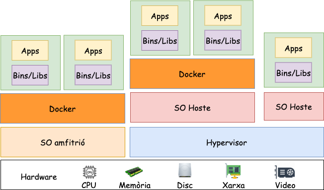{width=90mm}
:::

::: notes
La virtualització de contenidors és una tecnologia que permet als desenvolupadors empaquetar aplicacions i les seves dependències en un contenidor lleuger i portàtil que pot ser executat en qualsevol sistema que tingui un motor de contenidors.  

Per exemple, **Docker o containerd** són motors de contenidors que permeten als desenvolupadors crear i executar contenidors lleugers i portàtils. Aquests contenidors poden contenir aplicacions, serveis o microserveis, i es poden executar en qualsevol sistema que tingui un motor de contenidors instal·lat.

La principal diferència entre la virtualització de màquines virtuals i la virtualització de contenidors és el nivell d'abstracció. Mentre que les màquines virtuals virtualitzen tota una màquina física, incloent el sistema operatiu, els contenidors virtualitzen només l'aplicació i les seves dependències, compartint el mateix nucli del sistema operatiu hoste. Això fa que els contenidors siguin més lleugers i portàtils que les màquines virtuals, i permet als desenvolupadors crear i executar aplicacions de manera més eficient i fiable.
:::

## Kubernetes

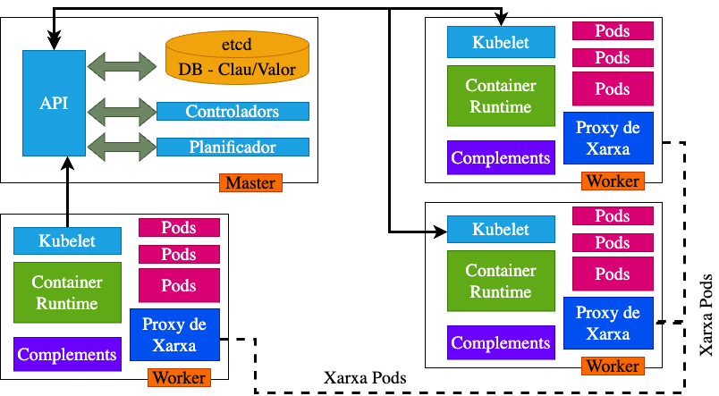

::: notes
Kubernetes és una plataforma de codi obert per a la gestió d'aplicacions en contenidors. Permet als desenvolupadors automatitzar el desplegament, l'escalat i la gestió d'aplicacions en contenidors, oferint una plataforma flexible i escalable per a la implementació d'aplicacions en entorns de producció.
Es basa en una arquitectura de màster i nodes, on el màster és responsable de la gestió i control del clúster, mentre que els nodes són els servidors on s'executen les aplicacions en contenidors. Requereix de diferents xarxes (com xarxa de control, xarxa de pod, xarxa de servei) per a la comunicació entre els components del clúster, a més necessita serveis de descobriment de serveis (com etcd) per a la gestió de la configuració i l'estat del clúster, controladors de xarxa (com Flannel) per a la comunicació entre els nodes, i controladors de volums (com Rook) per a la gestió de l'emmagatzematge persistent, un planificador (com kube-scheduler) per a la programació de les tasques, i un controlador de replicació (com kube-controller-manager) per a la gestió de la replicació de les aplicacions i sobretot el kubelet, que és l'agent que s'executa en cada node i és responsable de la gestió dels contenidors en el node. Com veieu, Kubernetes és una plataforma complexa que requereix una configuració i gestió adequades per a garantir el seu funcionament correcte.
:::

## Ansible

\onslide<1->

Ansible és una eina d'automatització de la configuració i gestió de sistemes. Utilitza un llenguatge senzill basat en `YAML` per definir les tasques i la configuració dels sistemes, i utilitza SSH per connectar-se als servidors i executar les tasques.

::: columns
::: {.column width="45%"}

\onslide<2->

```yaml
- hosts: webservers
  tasks:
    - name: Install Apache
      apt:
        name: apache2
        state: present
    - name: Start Apache
      service:
        name: apache2
        state: started
```

:::
::: {.column width="45%"}

\onslide<3->

```yaml
hosts:
  webservers:
    - web1.example.com
    - web2.example.com
    - web3.example.com
```

:::
:::

::: notes
Ansible és una eina d'automatització que ens permet gestionar la configuració dels servidors de manera eficient i fiable. Per exemple, si necessitem instal·lar un servidor web a 10.000 servidors, en lloc de fer-ho manualment en cada servidor, podem utilitzar Ansible per automatitzar aquesta tasca. Amb aquest script indiquem les tasques ha realitzar instal·lar apache i aixecar el servei. I en el fitxer de hosts indiquem els servidors on volem realitzar aquestes tasques.
:::

## Què és el Cloud Computing?

::: columns
::: {.column width="30%"}

\onslide<1->


:::
::: {.column width="60%"}

\onslide<2->

Lliurament de **recursos** sota demanda, incloent servidors, emmagatzematge, bases de dades, programari, analítica, i més, a través d'internet amb un model de *pagament per ús*.

\onslide<3->

- **SaaS**: Software com a Servei
  
\onslide<4->

- **PaaS**: Plataforma com a Servei

\onslide<5->

- **IaaS**: Infraestructura com a Servei

\onslide<6->

- **FaaS**: Funcions com a Servei

:::
:::

\onslide<7>
Els usuaris [poden accedir a aquests serveis de manera remota des de qualsevol ubicació amb connexió a internet]{.alert}. En lloc de posseir i mantenir la seva pròpia infraestructura informàtica o centres de dades, els usuaris i empreses poden llogar l'accés a qualsevol cosa, des d'aplicacions fins a emmagatzematge, d'un proveïdor de serveis al núvol.

::: notes
El cloud computing es refereix al lliurament sota demanda de serveis informàtics, incloent servidors, emmagatzematge, bases de dades, programari, analítica, i molt més, a través d'internet amb un model de pagament per ús.

Aquests recursos s'executen en servidors ubicats en grans centres de dades arreu del món. Els usuaris poden accedir-hi de manera remota des de qualsevol lloc amb connexió a internet. En lloc de posseir i mantenir la seva pròpia infraestructura, els usuaris i empreses poden llogar serveis des d'aplicacions fins a emmagatzematge d'un proveïdor de serveis al núvol. Els recursos es poden combinar com peces de LEGO per crear solucions a mida de les necessitats.

Aquest model ha permès l'evolució de l'administració de sistemes a un nivell superior, permetent als usuaris centrar-se en el desenvolupament d'aplicacions i serveis sense haver de preocupar-se de la infraestructura subjacents.
:::

## AWS

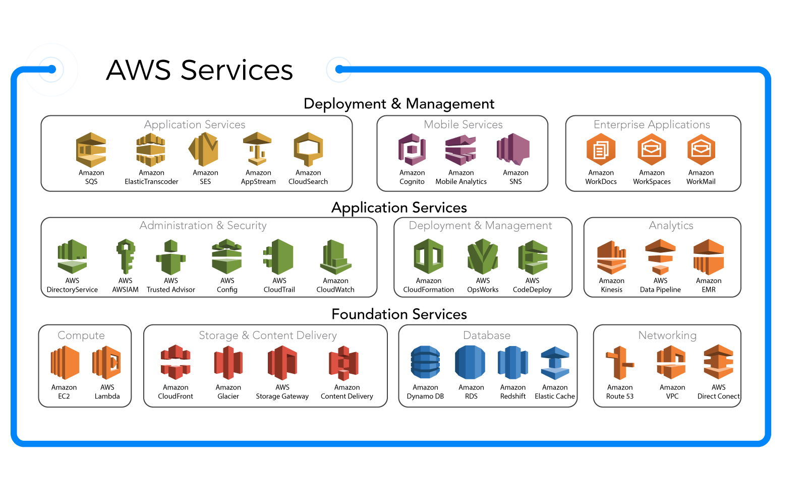{width=90mm}

::: notes
Amazon Web Services (AWS) és un proveïdor de serveis de computació en núvol que ofereix una àmplia gamma de serveis, incloent servidors virtuals, emmagatzematge, bases de dades, analítica, seguretat, i molt més. AWS permet als usuaris i empreses llogar recursos informàtics a través d'internet, oferint una plataforma flexible i escalable per a la implementació d'aplicacions en núvol. Altres proveïdors de serveis en núvol inclouen Microsoft Azure, Google Cloud Platform, IBM Cloud, i Oracle Cloud, però en aquest curs utilitzarem AWS per raons de popularitat i disponibilitat de recursos.
:::

## CloudFormation

\onslide<1->

CloudFormation és un servei d'AWS que permet als desenvolupadors definir i desplegar la infraestructura de manera programàtica mitjançant codi.

\onslide<2->

```yaml
Resources:
  MyInstance:
    Type: AWS::EC2::Instance
    Properties:
      ImageId: ami-0c55b159cbfafe1f0
      InstanceType: t2.micro
      KeyName: my-key-pair
      SecurityGroups:
        - my-security-group
```

::: notes
AWS CloudFormation és un servei que permet als desenvolupadors definir i desplegar la infraestructura de manera programàtica mitjançant codi. Aquest codi es defineix en plantilles de CloudFormation, que descriuen els recursos necessaris per a la infraestructura, com ara instàncies EC2, grups de seguretat, taules de rutes, ..., En aquest exemple, es defineix una instància EC2 amb una imatge AMI, un tipus d'instància, una clau SSH, i un grup de seguretat. Un cop es defineix la plantilla, es pot desplegar la infraestructura amb un sol clic o una sola comanda, automatitzant així el procés de desplegament i garantint la consistència de la infraestructura.
:::

## Això és tot per avui

::: center
[**PREGUNTES?**]{.alert}

:::

::: columns
::: {.column width="50%"}

### Materials del curs

- **Organització**   --- [AMSA-GEI-IGUALADA-2425](https://github.com/AMSA-2425-GEI-UDL)
- **Materials**    --- [Materials del curs](https://github.com/AMSA-2425-GEI-UDL/materials)
- **Laboratoris**  --- [Laboratoris](https://github.com/AMSA-2425-GEI-UDL/laboratoris)
- **Recursos**    --- [Campus Virtual](https://cv.udl.cat/)

[**TAKE HOME MESSAGE**]{.alert}: Un administrador de sistemes combina habilitats de bomber i investigador: ha de solucionar problemes de manera ràpida i efectiva, però també anticipar-se i prevenir-ne de futurs abans que esdevinguin crítics. Aquesta tasca és complexa i diversa, abastant des de la gestió de cables i servidors físics fins a l'administració de pods i sistemes automàtics sense servidor (*serverless*).

:::
::: {.column width="45%"}

:::center
{width=40mm}
:::

:::
:::
