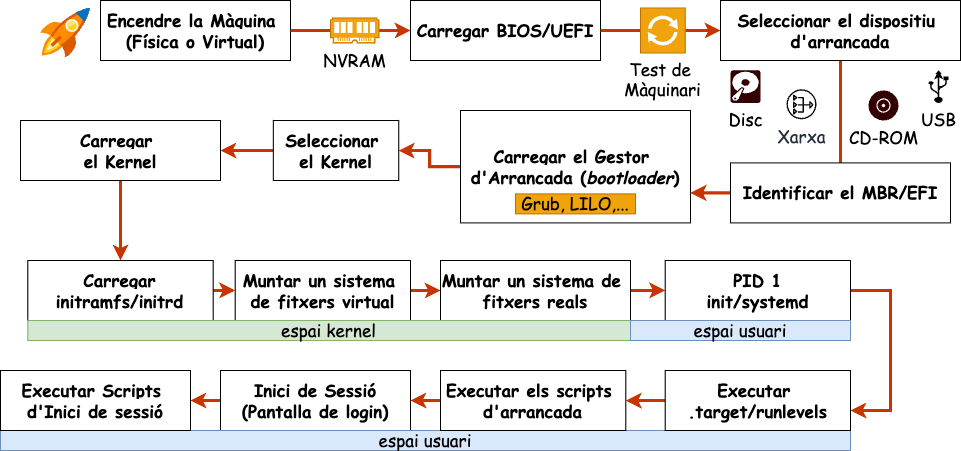
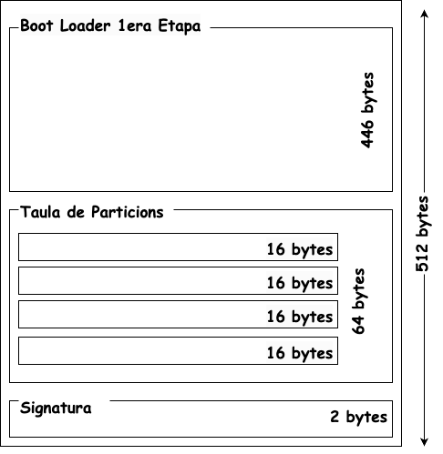
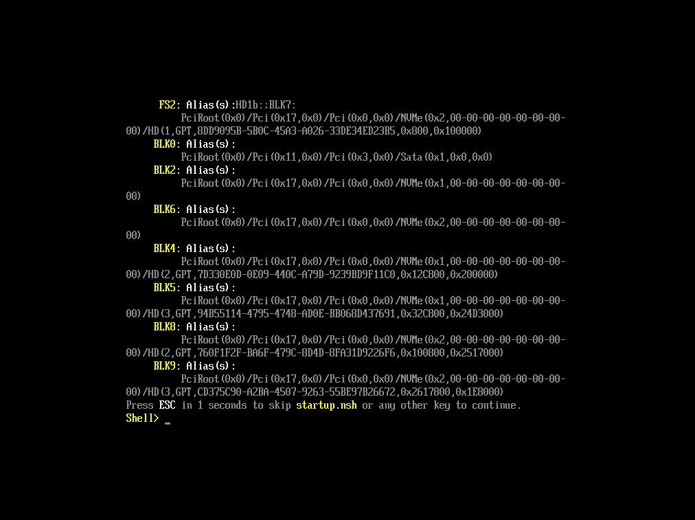

# Arrancada del sistema (*Booting*)

## Etapes de l'arrancada



# BIOS/UEFI

## Què és el BIOS/UEFI?

El primer programa que s'executa quan encenem un ordinador és el **BIOS** (*Basic Input/Output System*) en equips més antics, o l'**UEFI** (*Unified Extensible Firmware Interface*) en sistemes més moderns. Aquest firmware, emmagatzemat en una [memòria no volàtil (com ROM o memòria flash)]{.alert}, és el responsable d'inicialitzar el maquinari i permetre l'arrencada del sistema operatiu.

> - **Configuració del sistema**: Ajusta la data i l'hora, la seqüència d'arrencada, els dispositius de xarxa i altres perifèrics.
> - **Autotest d'engegada (POST)**: Realitza comprovacions inicials del sistema abans d'arrencar el sistema operatiu.
> - **Actualització de firmware**: Tant el BIOS com la UEFI es poden actualitzar per corregir errors, millorar la compatibilitat o afegir noves funcions de seguretat. [**Compte**: Actualitzar el firmware pot ser perillos, ja que un error durant el procés pot deixar el sistema inutilitzable]{.alert}.

## Diferències entre BIOS i UEFI

> - **Emmagatzematge**: La BIOS s'emmagatzema en un xip **ROM**, mentre que la UEFI pot estar en una **memòria flash (NVRAM) o fins i tot en un disc dur**.
> - **Arquitectura**: La BIOS és *monolítica* i no es pot modificar fàcilment, mentre que la UEFI és *modular*, la qual cosa permet afegir mòduls com gestors d'arrencada o eines de diagnòstic.
> - **Seguretat**: La UEFI ofereix funcions com *Secure Boot*, que protegeix el procés d'arrencada contra codi no autoritzat o maliciós.
> - **Preparació**: La BIOS necessita una taula de particions **MBR**, mentre que la UEFI requereix una taula de particions GUID (**GPT**) i una partició *EFI*.

## Taula de particions MBR

::: columns
::: {.column width="50%"}

### Estructura

- **Bootloader de primera etapa (446 bytes)**: Conté el codi d'arrencada.
- **Taula de particions (64 bytes)**: Conté la informació de les particions. Pot contenir fins a 4 entrades.
- **Signatura (2 bytes)**: Marca de final de la taula de particions. Permet identificar la taula de particions com a vàlida.

### Limitacions

Les principals limitacions de la MBR són la [**capacitat màxima de 2,2 TB**]{.alert} i la limitació a **4 particions primàries**.

:::
::: {.column width="50%"}

:::
:::

## Comparativa entre BIOS i UEFI

| Característica | BIOS | UEFI |
|----------|------|------|
| **Capacitat de disc** | Suporta fins a 2,2 TB | Suporta fins a 9,4 ZB |
| **Interfície** | Basada en text | Basada en gràfics |
| **Seguretat** | No té funcions de seguretat avançades | Suporta Secure Boot, que evita l'arrencada de codi maliciós |
| **Compatibilitat** | Limitada amb sistemes moderns | Compatible amb sistemes moderns i anteriors |
| **Velocitat d'arrencada** | Més lenta | Més ràpida |
| **Taua de particions** |  MBR | GPT |
| **Particions** | Suporta fins a 4 particions primàries | Suporta fins a 128 particions |
| **Modularitat** | No és modular | És modular, permet afegir mòduls i extensions |

## Què és la consola de la UEFI?

\onslide<1->

La **consola de la UEFI** és una interfície de línia de comandes que permet interactuar directament amb el firmware UEFI per realitzar tasques avançades de diagnòstic, configuració i manteniment del sistema.

\onslide<2->

::: columns
::: {.column width="50%"}

### Funcions

Aquesta consola és útil per als administradors de sistemes per configurar el maquinari, comprovar el funcionament dels dispositius, accedir als sistemes de fitxers i fins i tot instal·lar o reparar sistemes operatius sense un entorn gràfic complet.

:::
::: {.column width="50%"}

### Accés

Per accedir a la consola de la UEFI, normalment s'ha de prémer una tecla específica durant l'engegada del sistema. Aquesta tecla pot ser **F2**, **F10**, **F12**, **ESC** o **Supr** en funció del fabricant del maquinari.

:::
:::

\onslide<3->

**Nota**: Es pot accedir a la UEFI des de l'entorn de Windows, Linux o macOS, però aquesta opció pot variar en funció del fabricant del maquinari. Per exemple, en Linux es pot accedir a la UEFI amb la comanda `efibootmgr`.

## Exemple de consola de la UEFI

{width=120mm}

## Comandes de la consola de la UEFI

La consola UEFI ofereix una sèrie de comandes similars a les que es troben en la línia de comandes de Linux, permetent un control detallat del sistema.

> - **map**: Mostra els dispositius disponibles i les seves associacions amb les unitats lògiques del sistema. [Ex: `map fs*` llista tots els sistemes de fitxers detectats]{.alert}.
> - **mem**: Mostra el contingut de la memòria i l'ús de la RAM. [Ex: `memmap` mostra un mapa detallat de la memòria física]{.alert}.
> - **ls**: Mostra els fitxers i directoris dins del sistema de fitxers accessible. [Ex: `ls fs0:\EFI\Boot` llista els fitxers dins la partició EFI]{.alert}.
> - **cd**: Permet navegar entre carpetes. [Ex: `cd EFI\Boot` et mou a la carpeta d'arrencada dins la partició EFI]{.alert}.
> - **cp**: Copia fitxers entre diferents ubicacions dins dels sistemes de fitxers accessibles. [Ex: `cp fs0:\EFI\Boot\bootx64.efi fs1:\EFI\Backup\` copia un fitxer d'arrencada entre dues particions]{.alert}.
> - **edit**: Permet editar fitxers. Això és útil per modificar fitxers de configuració del sistema o scripts d'arrencada. [Ex: `edit fs0:\EFI\Boot\bootx64.efi` obre un fitxer EFI per editar-lo]{.alert}.

## Què és una partició EFI?

Una **partició EFI** és una partició especial del disc dur, requerida pels sistemes UEFI, que emmagatzema els fitxers necessaris per a l'arrencada del sistema operatiu. Aquesta partició sol ser de *100 a 550 MB*, es formata amb el sistema de fitxers **FAT32** i conté una carpeta anomenada **EFI** amb els fitxers necessaris per a l'arrencada.

::: columns
::: {.column width="50%"}

### Organització de la partició EFI

Si observeu l'estructura d'una partició EFI, veureu una carpeta **EFI** amb subcarpetes per a cada sistema operatiu instal·lat, com ara **Windows** o **Linux**. Aquestes subcarpetes contenen els fitxers necessaris per a l'arrencada del sistema operatiu, això ens permet indicar a la UEFI on es troba el bootloader de segona etapa de cada sistema operatiu.

\onslide<2->

:::
::: {.column width="50%"}

```text
/
├── boot
│   ├── efi
│   │   ├── EFI
│   │   │   ├── BOOT
│   │   │   │   ├── BOOTX64.EFI
```

:::
:::

## Observacions sobre la UEFI

\onslide<1->

### Importància de la partició EFI

La partició EFI és essencial per a l'arrencada del sistema operatiu en sistemes UEFI. Aquesta partició conté els fitxers necessaris per carregar el bootloader de segona etapa, com ara **GRUB** o el gestor d'arrencada de **Windows**. Sense aquesta partició, la UEFI no podria carregar el sistema operatiu i l'ordinador no podria arrencar.

\onslide<2->

### Es pot arrencar sense una partició EFI?

Es podria arrencar un sistema operatiu sense una partició EFI, per fer-ho, s'hauria de configurar la UEFI per carregar el bootloader de segona etapa directament des del disc dur sense passar per la partició EFI. Això és poc comú i no es recomana, ja que la partició EFI facilita la gestió de l'arrencada i permet tenir múltiples sistemes operatius instal·lats en el mateix disc dur.

# Bootloaders de segona etapa

## Carregar el gestor d'arrencada

El **bootloader** de segona etapa és responsable de carregar el **kernel** i el **initramfs** en la memòria RAM i iniciar el sistema operatiu. Aquest **bootloader** es troba en la partició EFI en sistemes UEFI o en el MBR en sistemes BIOS i és el responsable de carregar el sistema operatiu.

> - **LILO (LInux LOader)**: Un dels primers bootloaders de Linux, ara obsolet.
> - **GRUB (GRand Unified Bootloader)**: El bootloader més utilitzat en sistemes Linux. Compatible amb BIOS i UEFI.
> - **GRUB2**: Versió actualitzada de GRUB amb més funcionalitats i suport per a més sistemes de fitxers (FAT, NTFS,ext4). També ha millorat el *multiboot*.
> - **rEFInd**: Un gestor d'arrencada per a sistemes UEFI que permet arrencar múltiples sistemes operatius.
> - **Systemd-boot**: Un bootloader simple i ràpid dissenyat per a sistemes UEFI.No recomanat per a *multiboot*.
> - **Windows Boot Manager**: El bootloader de Windows, que permet arrencar Windows i altres sistemes operatius.

## GRUB

El fitxer de configuració principal de **GRUB** es troba a la ruta `/boot/grub/grub.cfg`, però aquest fitxer no s'ha d'editar directament, ja que es genera automàticament a partir dels fitxers de configuració situats a `/etc/default/grub` i els scripts en `/etc/grub.d/` en entorns Linux.

\onslide<2->

::: columns
::: {.column width="60%"}

### Configuració

- **set root='hd0,msdos1'**: Indica la partició arrel on es troba el sistema operatiu.
- **linux /vmlinuz root=/dev/sda1**: Indica la ruta del kernel i la partició arrel.
- **initrd /initramfs.img**: Indica la ruta de l'initramfs.
- **boot**: Inicia el sistema operatiu.

:::
::: {.column width="40%"}

### Exemple de configuració

```text
set root='hd0,msdos1'
linux /vmlinuz root=/dev/sda1
initrd /initramfs.img
boot
```

:::
:::

## Configuració del GRUB

El fitxer `/etc/default/grub` ens permet definir diferents parametres en forma de variables d'entorn per configurar diferents opcions d'arrancada.

| Variable               | Descripció                                                                                       |
|----------------------------------------|---------------------------------------------------------------------------------------------------|
| `GRUB_BACKGROUND`       | Imatge de fons que es mostrarà al menú d'arrencada.  |
| `GRUB_TIMEOUT`          | Temps en segons abans de carregar l'entrada predeterminada.      |
| `GRUB_DEFAULT`          | Entrada per defecte que es carregarà (index o nom)            |
| `GRUB_CMDLINE_LINUX`    | Opcions de línia de comandes que es passen al nucli en arrencar el sistema.                      |
| `GRUB_DISABLE_RECOVERY` | Si **true**, desactiva les opcions de mode de recuperació.  |
| `GRUB_DISABLE_OS_PROBER`| Si **true**, impedeix que GRUB busqui altres sistemes operatius instal·lats.       |
| `GRUB_PRELOAD_MODULES`  | Llista de mòduls GRUB que es carregaran abans de mostrar el menú d'arrencada.                    |

# Inici del sistema operatiu

## Carregar el kernel

El **kernel** és el nucli del sistema operatiu, *responsable de gestionar els recursos del sistema, com la memòria, el processador, els dispositius d'entrada/sortida, la xarxa i els processos d'usuari*. El kernel es carrega a la memòria RAM durant el procés d'arrencada i es troba normalment a la partició arrel del sistema de fitxers (generalment en **/boot**).

Per poder carregar el kernel, el bootloader ha de tenir informació sobre:

> - La ruta del kernel (normalment un fitxer anomenat **vmlinuz** en sistemes Linux).
> - La partició arrel on es troba el sistema de fitxers.
> - Aquesta informació es troba en el fitxer de configuració del bootloader (com **grub.cfg** en el cas de **GRUB**).
> - Un cop carregat el kernel a la memòria, aquest es prepara per iniciar el sistema operatiu carregant un sistema de fitxers temporal conegut com a **initramfs** (*initial RAM filesystem*).

# Initramfs o initrd

## Carregar el initramfs/initrd

L’Initramfs (**Initial RAM Filesystem**) és un petit sistema de fitxers integrat a la imatge del nucli Linux. Proporciona els fitxers necessaris perquè el kernel pugui muntar el sistema de fitxers arrel durant l'arrencada. A diferència de l'antic *Initrd*, que s'emmagatzemava en un disc separat, l’Initramfs es carrega completament a la memòria RAM com una imatge comprimida.

\onslide<2->

- **Objectiu**: Proporcionar un sistema de fitxers temporal i petit que permeti muntar el sistema de fitxers arrel i carregar els mòduls necessaris per arrencar el sistema operatiu.

\onslide<3->

- **Contingut**: Conté els mòduls del kernel, les eines necessàries per muntar el sistema de fitxers arrel, els scripts d'arrencada i altres fitxers necessaris per iniciar el sistema.

\onslide<4->

- **Configuració**: Es pot configurar durant la compilació del nucli o amb un fitxer de configuració específic.

\onslide<5->

L'Initramfs no sempre està present, pot estar buit o omès si el sistema no necessita un espai RAM inicial (per exemple, en sistemes simples o compilacions estàtiques del nucli).

## Contingut de l'initramfs

> 1. **Fitxers Executables**: Com BusyBox, que encapsula moltes eines Unix bàsiques en un únic executable, proporcionant shells i utilitats com `cp`, `ls`, `mount`, entre altres. A més, pot contenir llibreria dinàmiques i qualsevol programari que volguem executar durant l'arrencada.
> 2. **Mòduls del Kernel**: Inclou controladors de maquinari necessaris per accedir a dispositius com discos, xarxes, sistemes RAID o LVM. Aquests mòduls es carreguen des de l'Initramfs si no estan compilats directament dins del nucli.
> 3. **Fitxers de Dispositiu i Sistemes Especials**: El directori `/dev` conté fitxers de dispositiu com `dev/tty` o `dev/null`. La utilitat `mdev` o `udev` ajuda a gestionar dinàmicament aquests dispositius.

::: center
Tots aquests elements es troben comprimits en un fitxer CPIO que es descomprimeix a la memòria RAM durant l'arrencada i que s'executen seguint un script d'arrencada anomenat `/init`.
:::

## Configuració de l'initramfs

La configuració de l'**initramfs** es realitza en la compilació del nucli `make menuconfig` i es pot definir el contingut de l'**initramfs** amb un fitxer de configuració.

- **CONFIG_BLK_DEV_INITRD**: Activa la creació de l'**initramfs**.
- **CONFIG_INITRAMFS_SOURCE**: Especifica el fitxer CPIO, un directori o un fitxer d'especificació.

## Actualitzar l'initramfs

Tot i que l'**initramfs** es genera durant la compilació del nucli, es pot actualitzar manualment amb la comanda `update-initramfs` o `dracut` en funció de la distribució.

### Cas d'ús: Actualitzar l'initramfs

> - **Actualització del nucli**: Quan es *compila o instal·la un nou kernel*, l'initramfs associat ha de ser regenerat per garantir que carrega correctament els mòduls i el maquinari necessari.
> - **Configuració RAID**: Si es modifiquen o s'afegeixen sistemes *RAID*, l'initramfs ha de reflectir aquests canvis per assegurar un arrencada correcta.
> - **Xifrat de discos**: Per a sistemes amb particions xifrades (*LUKS*), cal actualitzar l'initramfs després de canvis en la configuració de xifrat per poder accedir a les particions durant l'arrencada.
> - **Configuració de xarxa**: Si es canvien components de xarxa que s'utilitzen en el procés d'arrencada (*sistemes amb arrencada PXE*).

## Cas d'us: USB amb clau de desxifrat

Un exemple de configuració avanzada seria l'ús d'un **USB amb clau** per desxifrar un disc dur amb **LUKS**. En aquest cas, el **initramfs** hauria de contenir un script que muntés el dispositiu USB, llegís la clau i desxifrés el disc dur.

```bash
#!/bin/busybox sh
mount -t proc proc /proc
mount -t sysfs sys /sys
mount /dev/sdb1 /mnt
KEYFILE=/mnt/keyfile
cryptsetup luksOpen /dev/sda1 crypted --key-file $KEYFILE
echo "Retira el dispositiu USB i prem Enter per continuar."
read
vgchange -a y
mount /dev/mapper/vg-root /mnt
exec switch_root /mnt /sbin/init
```

## PID 1: init/systemd

\onslide<1->

Quan s'acaba el procés d'inicialització del sistema en l'espai del kernel i es descomprimeix i executa l'initramfs, es produeix una transició important cap a l'espai d'usuari.

\onslide<2->

```bash
exec switch_root /mnt /sbin/init
```

\onslide<3->

En aquest moment, el sistema cedeix el control a un procés que s'executa en l'espai d'usuari. Aquest procés, anomenat **PID 1**, és el primer que es carrega i és essencial per a la gestió dels processos del sistema operatiu. Tradicionalment, el procés PID 1 en sistemes UNIX/Linux era el programa **init**, però en els sistemes moderns, *systemd* ha substituït *init* com a responsable principal de la gestió de processos.

## Funcions de PID 1

> 1. **Gestió de la inicialització del sistema**. Carrega els serveis i dimonis necessaris per al bon funcionament del sistema.
> 2. **Gestió dels processos del sistema**. Controla la creació, execució i finalització dels processos. Si un procés orfe (un procés que perd el seu procés pare) continua en execució, el PID 1 assumeix la seva gestió i, eventualment, la seva terminació.
> 3. **Arrel de l'arbre de processos**: Tots els altres processos del sistema pengen d'ell, directament o indirectament. Això fa que sigui fonamental per a l'estabilitat i la continuïtat del sistema.
> 4. **Apagat i reinici del sistema**: El PID 1 també és responsable de controlar l'apagat i reinici del sistema, garantint que els processos es tanquin adequadament i que el sistema es desconnecti de manera segura

## Systemd vs SysVinit

El canvi de **SysVinit** a **Systemd** en moltes distribucions de Linux va ser motivat per la necessitat de millorar l'eficiència i la gestió dels serveis del sistema.

::: columns
::: {.column width="45%"}

### SysVinit

- **Seqüencial**: Basat en scripts. *Cada servei depèn de l'execució completa del servei anterior, la qual cosa pot ser lenta*.
- **Simple**: Cada servei s'inicia amb un script directament llegible i modificable per l'administrador del sistema.
- **Inflexible**: Dificultat engestionar dependències. *No permet arrencar serveis en paral·lel ni controlar els processos un cop arrencats*.

:::
::: {.column width="55%"}

### Systemd

- **Rendiment**: Capacitat de carregar serveis en paral·lel. Reducció temps d'inici del sistema.
- **Modularitat**: Els serveis es gestionen a través d'unitats (*unit files*) que poden especificar dependències, condicions de reinici automàtic,etc.
- **Cgroups**: Limitar/gestionar els recursos assignats a cada servei.
- **Monitoratge**: Control i seguiment granular dels serveis amb *journalctl*.

:::
:::

## Crítiques a Systemd

Tot i les millores, **systemd** ha generat divisió en la comunitat Linux. Molts usuaris el consideren massa complex, monolític i que trenca amb la filosofia tradicional Unix de tenir eines petites que fan una sola tasca bé. D'altres valoren la simplicitat de **SysVinit**, on els scripts són més fàcils de modificar manualment.

## Cas d'estudi: Backdoor en XZ Utils i l'impacte en Systemd (I)

Recents vulnerabilitats en paquets com **xz-utils** han posat en evidència la complexitat de *Systemd* i com una [backdoor ocult]{.alert} pot comprometre gran part de la infraestructura moderna de Linux.

**[CVE-2024-3094](https://cve.mitre.org/cgi-bin/cvename.cgi?name=CVE-2024-3094)**: Vulnerabilitat que permet l'execució de codi maliciós en el sistema mitjançant un defecte en la descompressió de fitxers **.xz**.

### Funcionament

> - **liblzma**  és una llibreria de compressió que es pot enllaçar amb altres programes. Per exemple, **OpenSSH** es pot vincular a **liblzma** per gestionar la descompressió de fitxers de configuració.
> - En sistemes amb **systemd**, **OpenSSH** enllaça amb **systemd**, que a la vegada enllaça amb **liblzma**. Això permet a **XZ Utils** controlar indirectament serveis essencials com **sshd**.
> - Mitjançant una backdoor oculta en versions modificades de **xz-utils**, un atacant amb una clau de xifrat prèviament establerta podria carregar codi maliciós en certificats SSH i executar-lo en dispositius compromesos.
> Aquesta vulnerabilitat va afectar molts servidors Linux, que van actualitzar **xz-utils** amb la versió compromesa.

## Cas d'estudi: Backdoor en XZ Utils i l'impacte en Systemd (II)

### Com es va introduir la backdoor?

> - El backdoor va ser introduït de manera gradual, començant amb contribucions sospitoses al projecte **libarchive el 2021**.
> - Durant el 2022, un desenvolupador desconegut, *JiaT75*, va guanyar influència dins del projecte **xz-utils**, substituint el contacte del mantenidor original i introduint canvis que van ocultar les vulnerabilitats.
> - El 2023, *JiaT75* va introduir modificacions malicioses a **xz-utils**, aprofitant-les per comprometre sistemes a través de dependències amb [Systemd]{.alert}.

::: center
Aquests esdeveniments posen de manifest les contrapartides de la complexitat de **Systemd** i com una vulnerabilitat en un paquet aparentment inofensiu com **xz-utils** pot tenir un impacte significatiu en la seguretat del sistema i serveis crítics com **sshd**.
:::

## Executar els Targets o Runlevels

El **PID 1** executa els *targets* de systemd. En sistemes més antics, s'utilitzaven els *runlevels* d'init. Els targets representen un conjunt de serveis i mòduls que s'executen per a cada estat del sistema. La seva funció és definir l'estat del sistema i els serveis que s'han de carregar en aquest estat. La transició entre els *targets* es pot fer manualment amb la comanda `systemctl isolate` o automàticament amb la comanda `systemctl set-default`.

### Targets de systemd

> - **default.target**: Apunta a *graphical.target* o *multi-user.target*-
> - **graphical.target**: Defineix un entorn gràfic.
> - **multi-user.target**: Proporciona un entorn no gràfic, permetent múltiples usuaris al sistema, habitual per a servidors.
> - **rescue.target**: Proporciona un entorn de rescat amb una consola de línia de comandes.
> - **emergency.target**: Ofereix un entorn d'emergència que inicialitza el mínim de serveis necessaris per a la solució de problemes.

## Units de systemd

Els **units** són els fitxers de configuració de **systemd** que defineixen els serveis, ens permeten gestionar-los i controlar-los. Aquests fitxers es troben a la carpeta `/etc/systemd/system/` i poden ser de diversos tipus.

### Tipus d'unitats

> - **Serveis**: Fitxers que defineixen com s'inicien, s'aturen i es gestionen els serveis. Ex: `/etc/systemd/system/sshd.service` (servei SSH).
> - **Sockets**: Units que gestionen els *sockets* de comunicació per als serveis.
> - **Devices**: Units que representen dispositius de maquinari.
> - **Mounts**: Units que gestionen els punts de muntatge del sistema de fitxers.
> - **Paths**: Units que monitoren els canvis en fitxers o directoris específics.
> - **Timers**: Units que planifiquen tasques per a la seva execució en moments específics.
> - **Targets**: Units que agrupen altres units per a l'arrencada d'estats del sistema.

## Executar els startup scripts

Un cop en l'espai d'usuari, el **PID 1** executa els startup scripts del sistema, com ara el **/etc/rc.local** o els scripts de **systemd**.

::: columns
::: {.column width="50%"}


```bash
[Unit]
Description=Network Connectivity
Wants=network.target
After=network.target
[Service]
Type=oneshot
ExecStart=/usr/local/bin/network-start
ExecStop=/usr/local/bin/network-stop
RemainAfterExit=yes
[Install]
WantedBy=multi-user.target
```

:::
::: {.column width="50%"}

- **Unit**: Dependències i l'ordre d'execució. [Ex: `network.target` indica que el servei depèn de la disponibilitat de la xarxa]{.alert}.
- **Service**: Com s'executa el servei. [Ex: `ExecStart` i `ExecStop` indiquen els scripts que s'executen en iniciar i aturar el servei]{.alert}. El paràmetre `RemainAfterExit` indica que el servei es manté actiu després de finalitzar i el type `oneshot` indica que el servei s'executa una sola vegada.
- **Install**: En quin *target* s'instal·la el servei. [Ex: `multi-user.target`]{.alert}.

:::
:::

## Script de l'usuari

Un cop s'han carregat tots els serveis i el sistema està en marxa, els usuaris poden iniciar sessió al sistema. Els scripts de l'usuari es troben a la carpeta `/etc/profile.d/` i s'executen quan l'usuari inicia sessió.

> - **/etc/profile**: Conté la configuració global per a tots els usuaris. S'executa en iniciar sessió en un entorn de shell.
> - **/etc/bashrc**: Proporciona configuració per a shells interactius. S'executa cada vegada que s'inicia una nova sessió de shell.
> - **~/.bashrc**: Fitxer de configuració específic per a l'usuari, que s'executa en iniciar una sessió de shell interactiu.
> - **~/.bash_profile**: S'executa quan l'usuari inicia sessió a la terminal. Normalment, s'utilitza per configurar l'entorn de l'usuari, incloent la configuració de l'PATH.
> - **~/.bash_logout**: S'executa quan l'usuari tanca la sessió de shell. Aquí es poden incloure comandes de neteja o tancament.
> - **~/.bash_history**: Fitxer que emmagatzema l'històric de les comandes executades per l'usuari en la sessió de shell.

## Això és tot per avui

::: center
[**PREGUNTES?**]{.alert}

:::

::: columns
::: {.column width="50%"}

### Materials del curs

- **Organització**   --- [AMSA-GEI-IGUALADA-2425](https://github.com/AMSA-2425-GEI-UDL)
- **Materials**    --- [Materials del curs](https://github.com/AMSA-2425-GEI-UDL/materials)
- **Laboratoris**  --- [Laboratoris](https://github.com/AMSA-2425-GEI-UDL/laboratoris)
- **Recursos**    --- [Campus Virtual](https://cv.udl.cat/)

[**TAKE HOME MESSAGE**]{.alert}: El procés d'arrencada és un procés complex. Els administradors de sistemes han de conèixer aquest procés per poder gestionar i solucionar problemes durant l'arrencada del sistema i garantir un sistema segur, estable i eficient.

:::
::: {.column width="45%"}

:::center
{width=40mm}
:::

:::
:::
